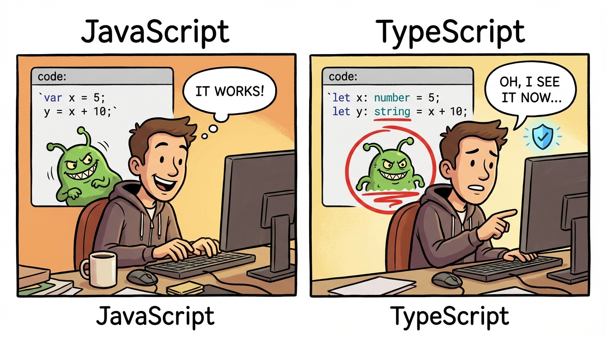

# TypeScript Fundamentals

A free, self-paced course for JavaScript developers learning **TypeScript** — typed JavaScript for web and application development. Twenty modules carry you from `let x: number = 0` through generics, async/await, schema-validated APIs, Vitest testing, and a CLI capstone you build end-to-end.

**Take the course live:** **<https://beekeeper-lab.github.io/TypeScript-Fundamentals/>**



---

This repository serves two audiences. Pick whichever describes you, or skim both — they're written to work together.

- **If you want to take the course**, start at the live URL above. Everything below is optional.
- **If you want to build a course like this**, most of this README is for you. The pipeline that produced the course — illustrations, narration, HTML, quizzes — is entirely here in the repo, documented and reproducible.

---

## Table of contents

- [Take the course](#take-the-course)
- [What's in this repo](#whats-in-this-repo)
- [How this course was built (the pipeline)](#how-this-course-was-built-the-pipeline)
  - [1. Content authored in markdown](#1-content-authored-in-markdown)
  - [2. Illustration generation via Gemini](#2-illustration-generation-via-gemini)
  - [3. Narration generation via ElevenLabs](#3-narration-generation-via-elevenlabs)
  - [4. HTML build and deploy](#4-html-build-and-deploy)
  - [5. Quizzes](#5-quizzes)
- [Running the pipeline locally](#running-the-pipeline-locally)
- [Repository map](#repository-map)
- [Design philosophy worth stealing](#design-philosophy-worth-stealing)
- [Status and credits](#status-and-credits)

---

## Take the course

**Live URL:** **<https://beekeeper-lab.github.io/TypeScript-Fundamentals/>**

Twenty modules (00 through 19), each narrated, illustrated, and quizzed. No login, no sign-up, no tracking — your progress checkmarks and quiz scores live privately in your browser's `localStorage` under the `ts_quiz_*` keys.

**Who this is for.** JavaScript developers who can read and write modern JS (ES2015+) and want a structured path into TypeScript. The course assumes you know what `const`, arrow functions, destructuring, `async/await`, and `import`/`export` are; it does not assume you've ever written a type annotation.

**What you'll learn.** Variables and primitives, arrays/tuples/objects, function signatures, control flow with type narrowing, type aliases and unions, interfaces, classes, generics, enums and utility types, custom type guards, ES modules, Promises, error handling with the Result pattern, JSON and typed `fetch`, npm and semver, `tsconfig` strict mode, Vitest testing, advanced patterns (decorators, builder, mapped/conditional/template-literal types), and a Task Tracker CLI capstone in Module 19.

**How long it takes.** Roughly 15-25 hours of self-paced reading + listening, plus exercise time on each module's *Sharpen Your Pencil* section.

**Prefer offline?** Each release also ships as a self-contained zip in [`dist/`](dist/). Unzip and open `index.html` in any browser — images and audio are bundled.

---

## What's in this repo

Source of truth for the course plus every tool that produces it:

```
TypeScript_Fundamentals/
├── source/                  # Markdown source for all 20 modules (module-XX-topic.md)
├── images/                  # 80 illustrations (4 per module), organized by module
├── audio/                   # 110 narration MP3s + per-module manifest.json
├── Quiz/                    # 20 quiz JSON banks (25 questions each, 80% to pass)
├── scripts/                 # Build and generation scripts (see pipeline below)
├── .github/workflows/       # GitHub Pages deploy workflow
├── IMAGE-PLAN.md            # Gemini prompts for every illustration
├── COURSE-BUILDER-GUIDE.md  # Authoritative documentation for the build pipeline
├── CONTENT-AUDIT.md         # Page-by-page QA review (drove the v1.1 prose-rewrite pass)
├── CLAUDE.md                # Project instructions for Claude Code sessions in this repo
└── Gradebook.md             # Desktop quiz runner writes scores here
```

A note on numbering: source files are zero-indexed (`module-00` through `module-19`), but quiz folders are one-indexed (`Day_01_Quiz_File` through `Day_20_Quiz_File`) to stay compatible with the shared `quiz_app.py` that serves the rest of the portfolio. Module 0 maps to Quiz Day 1.

---

## How this course was built (the pipeline)

This is the section for builders. It walks through the actual sequence that produced every page you see live.

### 1. Content authored in markdown

Everything starts in `source/module-XX-topic.md`. One file per module. Pages are separated by `## ` headings; the HTML builder paginates automatically.

A typical module file contains:

- **Teaching intents** at the top — three lines that state what students should *Teach* / *See* / *Feel* by the end.
- **Inline illustrations** — `` + a caption on the next line.
- **Narration blocks** — `> 🎙️ Welcome to Module 1...` blockquotes are picked up by the narration pipeline and spoken aloud on the page.
- **What to notice callouts** — `> 💡 **What to notice:**` blocks placed *after* code listings to flag the specific lines, types, or behaviors a reader should focus on. This pattern came out of the [content audit](#5-quizzes) (more under [Design philosophy](#design-philosophy-worth-stealing)).
- **Pitfall sidebars** — `> ⚠️ **Common pitfall:**` blocks paired with the *What to notice* callouts to surface the mistake JS-instinct makes here.
- **Sharpen Your Pencil** sections — exercise lists at the end of each module.
- **Up Next** sections — Teach/See/Feel preview of the following module.

### 2. Illustration generation via Gemini

All 80 illustrations (4 per module across 20 modules) are generated by **Google Gemini** (`gemini-3-pro-image-preview`, "Nano Banana") from prompts catalogued in [`IMAGE-PLAN.md`](IMAGE-PLAN.md).

**Process:**

1. Write the image into the content file as `` — the file doesn't exist yet.
2. Add a corresponding entry in `IMAGE-PLAN.md` with the Gemini prompt (4-6 sentences describing scene, style, palette).
3. Run `uv run --with google-genai python scripts/generate_images.py` — the script parses the plan, finds entries whose PNG doesn't yet exist, generates each via Gemini, and writes it to disk.
4. Rebuild the course; `build_course.py` inlines every PNG as a base64 data URI so the distribution zip is fully offline-capable.

The IMAGE-PLAN doubles as documentation: every image has a canonical prompt that can be re-generated, tweaked, or restyled.

### 3. Narration generation via ElevenLabs

Every `> 🎙️ ...` block in source markdown becomes an MP3 file, spoken by the **ElevenLabs** Rachel voice. The course ships 110 narration MP3s.

**Process:**

1. Author narration inline in the markdown, one `> 🎙️` block per teaching beat (typically 2-4 sentences).
2. Run `uv run --with elevenlabs python scripts/generate_narration.py` — the script parses every source file's narration blocks, numbers them by position, and generates MP3s into `audio/<module-slug>/NN_<module-slug>.mp3`.
3. Each module has an `audio/<module-slug>/manifest.json` recording which text each MP3 corresponds to. The script supports `--regenerate-changed` to detect drift between text and audio.

### 4. HTML build and deploy

`scripts/build_course.py` renders every source markdown file into an HTML page using `scripts/module_template.html`. Outputs go to `html/` plus `index.html` at the repo root.

What the build does:

- Markdown → HTML via Python-Markdown + Pygments for code highlighting.
- Paginates each module at every `## ` heading.
- Embeds every image as a base64 data URI.
- Processes custom blocks: narration players (with hush toggle + autoplay + click-to-start fallback), teaching-intent cards, what-to-notice callouts.
- Injects a Module Quiz page per module (second-to-last, before *Up Next*) with the matching quiz JSON embedded inline.

**Deployment** is via [`.github/workflows/pages.yml`](.github/workflows/pages.yml). Every push to `main` triggers a GitHub Actions run that rebuilds the course and publishes to GitHub Pages.

For offline distribution, `scripts/deploy.py` produces a self-contained zip.

### 5. Quizzes

Two runners, one set of questions. Both read the same JSON banks at `Quiz/Day_XX_Quiz_File/day_XX_quiz.json` (20 files, 25 questions each, 20/25 = 80% to pass).

- **In-browser quiz.** Each module's built HTML has an embedded `<script type="application/json" id="quiz-data">` block with the full quiz, plus a runner that paints into the Module Quiz page. Timer, shuffle, submit/timeout, review-answers summary, retake. Scores persisted in `localStorage` under `ts_quiz_<slug>_best`, `ts_quiz_<slug>_attempts`, and `ts_quiz_<slug>_last`.
- **Desktop tkinter quiz.** The shared `quiz_app.py` at the portfolio root provides a full-screen quiz window. Results write to [`Gradebook.md`](Gradebook.md). Run from the parent directory:

  ```bash
  python ../quiz_app.py TypeScript_Fundamentals <day>   # day is 1-20
  ```

  The `module-XX` source naming is offset by one from the `Day_XX` quiz naming: Module 0 ↔ Day 1, Module 19 ↔ Day 20.

---

## Running the pipeline locally

All scripts use [`uv`](https://github.com/astral-sh/uv) for dependency management — no virtualenv setup required. Commands run from the repo root.

```bash
# 1. Build the course HTML (rebuild any time source changes)
uv run --with markdown --with pygments python scripts/build_course.py

# 2. Build a single module (faster iteration)
uv run --with markdown --with pygments python scripts/build_course.py --module module-00-what-is-typescript

# 3. Generate any missing illustrations (skips images that already exist)
uv run --with google-genai python scripts/generate_images.py

# 4. Generate narration audio (only generates missing or changed files)
uv run --with elevenlabs python scripts/generate_narration.py

# 5. Build the distribution zip (self-contained, browser-offline)
uv run --with markdown --with pygments python scripts/deploy.py --version 1.0

# 6. Run any module's quiz in the desktop tkinter app
python ../quiz_app.py TypeScript_Fundamentals 1
```

**API keys needed** (only for generation scripts, not for building or reading):

- `GEMINI_API_KEY` for image generation (read from `.env` in the course directory — never committed)
- `ELEVENLABS_API_KEY` for narration

Reading the course and rebuilding the HTML requires **no API keys**. All generated assets are committed.

---

## Repository map

A one-screen view of what lives where:

```
.github/workflows/pages.yml    # CI: build + deploy to GitHub Pages on push
CLAUDE.md                       # Instructions for Claude Code in this repo
COURSE-BUILDER-GUIDE.md         # Full build pipeline documentation
CONTENT-AUDIT.md                # Page-by-page QA review (drove v1.1 prose pass)
Gradebook.md                    # Desktop quiz runner writes scores here
IMAGE-PLAN.md                   # Gemini prompts for all 80 illustrations
README.md                       # You are here
favicon.png                     # Course favicon

source/                         # Course content (markdown → HTML)
└── module-00..module-19        # 20 modules, one file each

images/                         # 80 PNGs (4 per module)
└── module-00/..module-19/

audio/                          # 110 MP3s + manifest.json per module
└── module-XX-topic/

Quiz/                           # 20 quiz JSON banks
└── Day_XX_Quiz_File/day_XX_quiz.json   # XX = (module number + 1), 1..20

scripts/                        # Build + generation pipeline
├── build_course.py             # Markdown → HTML + index, embeds quiz JSON
├── deploy.py                   # Build + bundle into dist/ zip
├── generate_images.py          # IMAGE-PLAN.md + Gemini → PNGs
├── generate_narration.py       # 🎙️ blocks + ElevenLabs → MP3s
└── module_template.html        # HTML shell with runtime JS/CSS
```

---

## Design philosophy worth stealing

If you're building your own narrated, illustrated, self-paced technical content, these are the choices in this repo that paid off:

1. **Everything is markdown, including the thing that generates the HTML.** One source of truth. Narrators, illustrators, and the HTML builder all read the same files. Editing is `vim source/module-05-type-aliases-and-unions.md`, not round-tripping through a CMS.
2. **Every asset has a plan.** Illustrations are catalogued in `IMAGE-PLAN.md` with the exact Gemini prompt. Narrations live in `🎙️` blocks inside the prose. Re-generating, tweaking, or re-voicing any asset is deterministic and cheap.
3. **"What to notice" beats "the code is the explanation."** A v1 audit ([`CONTENT-AUDIT.md`](CONTENT-AUDIT.md)) classified all 131 H2 pages as Polished / Adequate / Thin / Code-only. Thirteen *Thin* and *Code-only* pages — clustered around the "Program X: filename.ts" pattern in modules 2, 3, and 6 — were rewritten with two-to-four paragraphs of teaching prose, a `> 💡 **What to notice:**` callout *after* the code listing pointing at specific lines and behaviors, and a paired `> ⚠️ **Common pitfall:**` sidebar where appropriate. The pattern is worth stealing: code listings are evidence, not instruction. The prose around the code does the teaching; the *What to notice* callout tells the reader where to look so they don't have to reverse-engineer the lesson from the code.
4. **One runner, many courses.** The desktop quiz runner is shared across the whole portfolio. The `Day_XX_Quiz_File` naming on the quiz folders matches the seven other day-based courses, even though this course's source files are module-numbered. One bug fix, eight courses benefit.
5. **Graceful degradation for every runtime feature.** Narration auto-plays by default but shows a click-to-start banner when browsers block autoplay. Images are base64-embedded so the zip works offline. Quiz scores persist to `localStorage` because there's no backend and that's fine.
6. **Audit before you ship a v1.** A page-by-page classification took an afternoon and turned a "looks done" v1 into a v1.1 with thirteen newly-rewritten teaching pages. The audit doc itself stayed in the repo as a record of what good and not-good looked like, so the same standard can be re-applied as content drifts.

---

## Status and credits

**Curriculum-complete.** Twenty modules authored. 80 illustrations generated. 110 narration MP3s recorded. Twenty quizzes (500 questions total) embedded inline and runnable in the desktop app. Content-audit prose-rewrite pass complete on the modules where it was needed. Hosting is free (GitHub Pages on a public repo); the deployed URL is the one at the top of this README.

Illustrations generated via **Google Gemini** (`gemini-3-pro-image-preview`). Narrations generated via **ElevenLabs** (Rachel voice). Built and maintained as part of the **Stonewaters Consulting** internship curriculum portfolio.

**Questions, issues, pull requests** → use the GitHub Issues and Pull Requests tabs of this repo.
