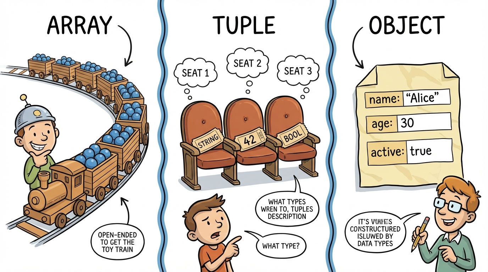
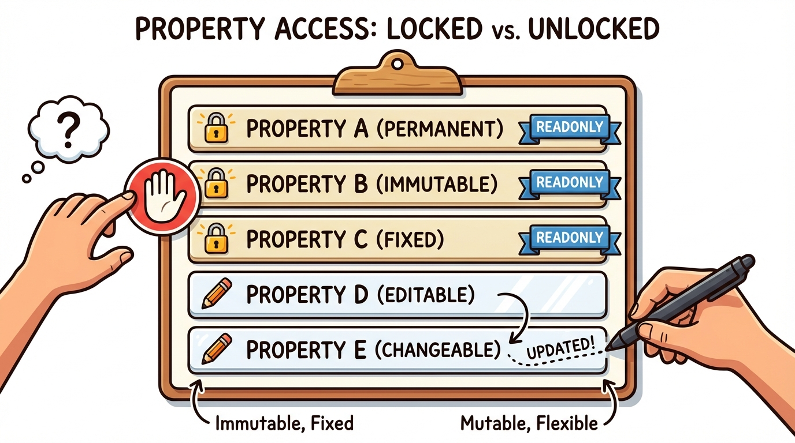
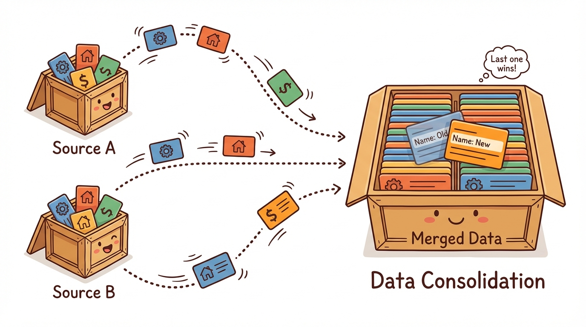
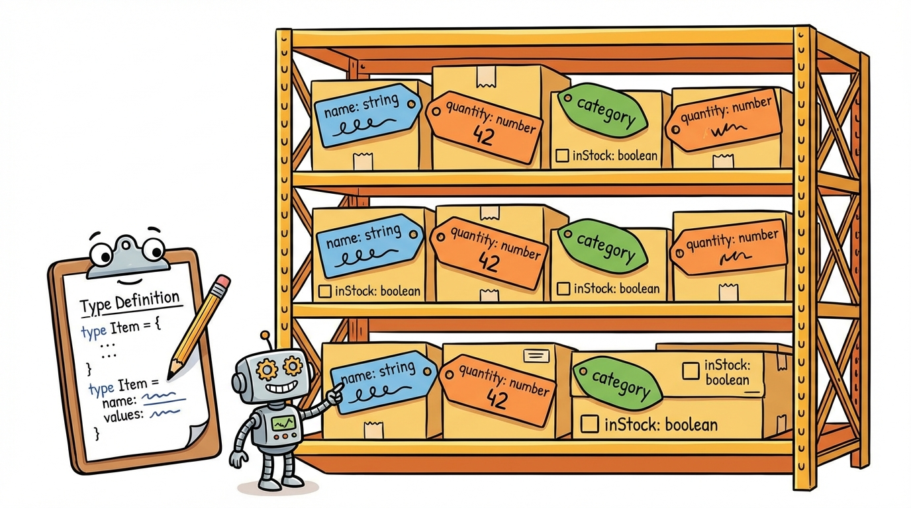

# Module 2: Arrays, Tuples, and Objects

> 🏷️ Start Here

> 🎯 **Teach:** How to structure data using TypeScript's collection and object types. **See:** The difference between arrays (same-type collections), tuples (fixed-length typed positions), and objects (named fields). **Feel:** Confident choosing the right data structure for the job.

> 🔄 **Where this fits:** Module 1 gave you the primitive types. Now you combine them into structures. Arrays, tuples, and objects are how real programs organize data — from API responses to database records to configuration objects. Every module from here forward uses these structures.




## Arrays

> 🎯 **Teach:** How to declare typed arrays that enforce a single element type across the entire collection. **See:** Array declarations using both `type[]` and `Array<type>` syntax, including union type arrays. **Feel:** Clear on how TypeScript prevents you from accidentally mixing incompatible types in an array.

### Typed Arrays

```typescript
let numbers: number[] = [1, 2, 3, 4, 5];
let names: string[] = ["Alice", "Bob"];
let mixed: (string | number)[] = [1, "two", 3]; // Union type array

// Alternative syntax
let scores: Array<number> = [88, 92, 76];
```

## Tuples

> 🎯 **Teach:** How tuples differ from arrays — fixed length, specific type at each position — and when to use them. **See:** Tuple declarations for points, key-value pairs, and RGB colors, with TypeScript enforcing types at each index. **Feel:** Confident distinguishing tuples from arrays and knowing when a tuple is the better choice.

### Fixed-Length Typed Arrays

> 🎙️ Arrays and tuples look similar — they both use square brackets — but they serve different purposes. An array is a collection of values that are all the same type. You do not know how many there will be, and you access them by iterating. A tuple is a fixed-length structure where each position has its own specific type. Think of a tuple as a lightweight object without field names. When a function needs to return two values, a tuple is often the right choice.

```typescript
let point: [number, number] = [3, 4];
let entry: [string, number] = ["Alice", 88];
let rgb: [number, number, number] = [255, 128, 0];
```

## Object Types

> 🎯 **Teach:** How to define inline object types with required, optional, and readonly properties. **See:** Object literals with typed fields, optional properties using `?`, and `readonly` preventing mutation at compile time. **Feel:** Able to model real-world entities as typed objects with precisely the shape you need.




### Inline Object Types

```typescript
let person: { name: string; age: number; active: boolean } = {
    name: "Campbell",
    age: 20,
    active: true,
};

// Optional properties with ?
let config: { host: string; port: number; debug?: boolean } = {
    host: "localhost",
    port: 3000,
    // debug is optional — can be omitted
};
```

### Readonly

> 🎙️ The `readonly` modifier is one of TypeScript's most useful tools for preventing accidental mutation. When you mark a property or array as readonly, TypeScript will stop you at compile time if you try to change it. This is especially valuable for IDs, configuration values, and any data that should be set once and never modified. Note that readonly is a compile-time check only — it does not exist at runtime in JavaScript.

```typescript
const point: readonly number[] = [1, 2, 3];
// point.push(4);  // Error: push does not exist on readonly number[]

let user: { readonly id: number; name: string } = { id: 1, name: "Alice" };
// user.id = 2;    // Error: Cannot assign to 'id'
user.name = "Bob"; // OK — only id is readonly
```


---

## Typed Arrays in Depth

> 🎯 **Teach:** How to use typed arrays with full type safety — push, map, filter, reduce, sort, spread, and destructuring. **See:** A complete program that manipulates number arrays while TypeScript guards every operation. **Feel:** Fluent with array operations and confident that TypeScript catches mistakes at each step.

Once you have a typed array, every single operation you perform on it is checked by the compiler. This is where TypeScript's array support starts to feel meaningfully different from plain JavaScript. When you write `grades.push("A")`, TypeScript does not just know `grades` exists — it knows it is a `number[]`, and it knows `push` on a `number[]` accepts only numbers. The mistake is caught before your code runs. That is a humble-sounding guarantee, but it eliminates a whole class of bugs that plague dynamically typed codebases.

The bigger payoff is with the functional methods — `map`, `filter`, `reduce`, `find`, `sort`. Each one preserves type information through the chain. `grades.map(g => g * 2)` returns a `number[]` because doubling a number gives you a number. `grades.filter(g => g >= 80)` keeps the type as `number[]`. `grades.reduce((sum, g) => sum + g, 0)` returns a single `number`. You never have to annotate the callback parameters, because TypeScript infers them from the array type. Hover over `g` in your editor and you will see `number` — the compiler is quietly tracking types through every transformation.

Destructuring works with arrays too, including the `...rest` pattern that collects the remaining elements into a new array. `const [first, second, ...rest] = sorted` gives you three bindings, all typed correctly: `first` and `second` are `number`, and `rest` is `number[]`. Spread works in the opposite direction — `[...grades]` creates a new array with the same elements, which is the safe way to sort or modify without mutating the original.

Pitfall to watch: array methods like `sort` and `reverse` mutate in place. If you want a sorted copy without changing the original, spread first: `[...grades].sort(...)`. This is especially important with `const` arrays — `const` prevents you from reassigning the variable, but it does not prevent mutation of the array contents.

### Program A: arrays.ts

```typescript
// Typed arrays
const grades: number[] = [88, 92, 76, 95, 83];
const languages: string[] = ["TypeScript", "Python", "Java", "Dart"];
const flags: boolean[] = [true, false, true, true];

// Array methods work with type safety
grades.push(91);
// grades.push("A");  // Error: string not assignable to number

console.log(`Grades: ${grades}`);
console.log(`Average: ${(grades.reduce((a, b) => a + b) / grades.length).toFixed(1)}`);
console.log(`Highest: ${Math.max(...grades)}`);
console.log(`Lowest: ${Math.min(...grades)}`);

// Map, filter, reduce — TypeScript infers return types
const doubled = grades.map(g => g * 2);          // number[]
const passing = grades.filter(g => g >= 80);      // number[]
const total = grades.reduce((sum, g) => sum + g, 0); // number

console.log(`Doubled: ${doubled}`);
console.log(`Passing (>=80): ${passing}`);
console.log(`Total: ${total}`);

// Sorting
const sorted = [...grades].sort((a, b) => a - b);
console.log(`Sorted: ${sorted}`);

// Destructuring
const [first, second, ...rest] = sorted;
console.log(`First: ${first}, Second: ${second}, Rest: ${rest}`);
```

### What to notice

- **The commented-out `grades.push("A")` would be a compile error** because TypeScript knows `grades` holds numbers. This is exactly the kind of silent bug that JavaScript's dynamic typing lets slip through.
- **`map`, `filter`, and `reduce` all infer their types from `grades`.** You never annotate the callback parameters. Hover over `g` in your editor to see TypeScript's inferred `number` type.
- **`[...grades].sort(...)` creates a fresh copy first.** Without the spread, sort would mutate the original array — a classic source of surprise bugs, especially when multiple parts of a program share the same array.

---

## Tuples in Depth

> 🎯 **Teach:** Advanced tuple features — labeled tuples, optional elements, destructuring, and functions that return tuples. **See:** Tuples used for coordinates, key-value pairs, and multi-value returns with full type safety at each position. **Feel:** Ready to use tuples as lightweight, typed alternatives to objects when field names are not needed.

Tuples are the lightweight sibling of objects. They cost you less syntax — no field names, no curly braces — but in exchange you give up self-documenting access. A point is `[3, 4]` rather than `{ x: 3, y: 4 }`. Which form is better depends on how far apart the definition and the usage sit. Inside a tightly scoped function, a tuple is often clearer; across module boundaries, named object fields usually win because the reader does not have to remember what position three meant.

The signature feature of a tuple is that **each position has its own type**. A `[string, number]` is not the same as a `(string | number)[]` — the first one says "exactly two elements, a string then a number," while the second says "any number of elements, each either a string or a number." That positional precision is what makes tuples great for multi-value returns. When `getMinMax` returns `[number, number]`, the caller can destructure directly into `[min, max]` with no confusion about which is which.

TypeScript 4 added two useful refinements. **Labeled tuples** let you attach names inside the brackets — `[x: number, y: number, z: number]` — as documentation. The labels do not affect the type at runtime, but they show up in editor hints and make multi-value return types much easier to read. **Optional tuple elements** use the same `?` syntax you have seen on object properties; `[number, number, number?]` accepts either a 2D point or a 3D point from the same type. These features close the remaining usability gap between tuples and small objects for scenarios where you want fixed-position data.

Pitfall to watch: many JavaScript APIs already return "tuple-ish" values that TypeScript types as plain arrays. `Object.entries(obj)` returns `[string, any][]`, which is a tuple inside an array — the inner structure is positional. If you hand-roll a utility that returns `[key, value]`, remember to annotate the return as a tuple explicitly; TypeScript's default inference for array literals often widens to a plain array.

### Program B: tuples.ts

```typescript
// Basic tuples
const point: [number, number] = [10, 20];
const nameAge: [string, number] = ["Campbell", 20];
const rgb: [number, number, number] = [255, 128, 0];

// Destructuring tuples
const [x, y] = point;
const [name, age] = nameAge;
const [r, g, b] = rgb;

console.log(`Point: (${x}, ${y})`);
console.log(`${name} is ${age} years old`);
console.log(`RGB: rgb(${r}, ${g}, ${b})`);

// Labeled tuples (TypeScript 4.0+)
type Coordinate = [x: number, y: number, z: number];
const position: Coordinate = [1, 2, 3];

// Tuples with optional elements
type FlexPoint = [number, number, number?];
const point2D: FlexPoint = [5, 10];
const point3D: FlexPoint = [5, 10, 15];

console.log(`2D: ${point2D}`);
console.log(`3D: ${point3D}`);

// Tuple vs Array — key difference
const tuple: [string, number] = ["Alice", 88];
// tuple[0] = 42;   // Error: number not assignable to string
// Tuples enforce type at each position

// Practical use: function returning multiple values
function getMinMax(nums: number[]): [number, number] {
    return [Math.min(...nums), Math.max(...nums)];
}

const [min, max] = getMinMax([3, 1, 4, 1, 5, 9]);
console.log(`Min: ${min}, Max: ${max}`);
```

### What to notice

- **`tuple[0] = 42` would fail to compile** because position zero of `tuple` was declared as `string`. Each slot has its own type, and TypeScript enforces that even when you reach in by index.
- **Labeled tuples like `[x: number, y: number, z: number]`** are documentation-only at runtime, but editors use the labels in tooltips and refactors. For a multi-value return, labels save the reader a trip back to the type definition.
- **`getMinMax` returns a `[number, number]`** — not a `number[]`. That matters for destructuring. `const [min, max] = ...` works cleanly, and there is no possibility of the return having one or three elements.

---

## Object Types in Depth

> 🎯 **Teach:** How to build complex object types with optional, readonly, and nested properties. **See:** Inline object types for a student, a server config, and a company with a nested address — each demonstrating different property modifiers. **Feel:** Comfortable modeling real-world data structures with precise object types.

Real programs model their domains as objects — users, orders, configurations, addresses, products. TypeScript gives you a full vocabulary for describing the exact shape each object should have, directly inline on the variable declaration. You can mark properties optional with `?`, mark them `readonly` to prevent mutation, and nest object types inside other object types for hierarchical data. The result is a precise, self-documenting description of the data that the rest of your program can rely on.

The student example below shows the default case: every property is required, every property is mutable. The configuration example adds two optional fields — `debug?` and `timeout?` — which is the idiomatic way to say "sensible defaults are used when these are missing." The server example uses `readonly id` to freeze the identifier after construction while leaving the other fields editable. And the company example shows nesting — an address is itself an object, declared inline as the type of a field.

Inline object types are perfect for small, one-off shapes. But as soon as the same shape shows up in more than one place, you should pull it into a named `type` alias or (as you will learn in Module 6) an `interface`. Repeating the same long inline type is where most "my types got out of sync" bugs come from — the two copies drift apart and you are one refactor away from a confusing error.

Pitfall to watch: TypeScript has structural typing, which means two object types are compatible if their shapes match, regardless of how they were declared. That is usually what you want, but it has an edge: an object literal passed directly into a function can surprise you with an "excess property" error if it has fields the parameter type does not mention. Assign the literal to a variable first, or use `as` to cast, if you are intentionally passing extra fields.

### Program C: objects.ts

```typescript
// Inline object type
const student: {
    name: string;
    age: number;
    gpa: number;
    courses: string[];
    graduated: boolean;
} = {
    name: "Campbell",
    age: 20,
    gpa: 3.8,
    courses: ["TypeScript", "Python", "Java"],
    graduated: false,
};

console.log(`Student: ${student.name}`);
console.log(`Courses: ${student.courses.join(", ")}`);

// Optional properties
const config: {
    host: string;
    port: number;
    debug?: boolean;    // Optional
    timeout?: number;   // Optional
} = {
    host: "localhost",
    port: 3000,
};

console.log(`Config: ${config.host}:${config.port}`);
console.log(`Debug: ${config.debug ?? "not set"}`);

// Readonly properties
const server: {
    readonly id: string;
    name: string;
    status: string;
} = {
    id: "srv-001",
    name: "Main Server",
    status: "running",
};

server.status = "stopped";  // OK
// server.id = "srv-002";   // Error: Cannot assign to 'id'

// Nested objects
const company: {
    name: string;
    address: {
        street: string;
        city: string;
        state: string;
    };
    employees: number;
} = {
    name: "Stonewaters Consulting",
    address: {
        street: "123 Main St",
        city: "Austin",
        state: "TX",
    },
    employees: 50,
};

console.log(`${company.name} — ${company.address.city}, ${company.address.state}`);
```

### What to notice

- **The inline type on `student` is long.** That is fine for a single variable, but if three functions all expect the same shape, extract it into a named type. Inline types that repeat are the single biggest source of "drift" in TypeScript codebases.
- **`config.debug` is typed as `boolean | undefined`** because the field is optional. Use the `??` operator (`config.debug ?? false`) when you need a concrete default, or guard with `if (config.debug)` when you just need to know whether it is set.
- **`server.id = "srv-002"` is a compile error; `server.status = "stopped"` is allowed.** Readonly is per-property, not per-object. Use it on fields that should be immutable and leave the rest mutable.
- **Nesting the address type inline** is clear for an example, but when `Address` is shared across many models (customers, vendors, shipping, billing) pull it into a named type and reuse it.

---

## Spread and Destructuring

> 🎯 **Teach:** How spread and destructuring work with TypeScript's type system for copying, merging, and extracting values from objects and arrays. **See:** Object destructuring with rename, spread for merging objects, array spread for concatenation, and rest syntax. **Feel:** Empowered to write concise, readable code for common data manipulation patterns.



Spread (`...`) and destructuring are two sides of the same coin: destructuring pulls fields *out* of a container by name, and spread copies fields *in*. Together they give you a concise, type-safe vocabulary for the three most common data-manipulation tasks: extracting selected fields, copying and merging objects, and concatenating arrays. Professional TypeScript code uses these operators constantly, especially when shaping API request payloads or merging configuration objects.

Destructuring mirrors the shape of the data. `const { name, age } = person` creates two new bindings whose types come directly from the `person` type — no annotations needed. The rename syntax (`const { name: fullName } = person`) lets you avoid naming collisions when two destructured objects both define `name`. And the rest syntax (`const { theme, ...otherPrefs } = merged`) collects every field you did *not* name explicitly into a new object.

Spread is the inverse. Inside an object literal, `{ ...defaults, ...userPrefs }` copies all fields from `defaults`, then layers `userPrefs` on top. Later spreads override earlier ones, which is the classic pattern for building a final configuration from defaults plus overrides. Inside an array literal, `[...arr1, ...arr2]` concatenates. Both operations produce new containers — the originals are not modified, which is essential for predictable, refactor-safe code.

Pitfall to watch: object spread is a **shallow** copy. If your object contains nested objects or arrays, the nested references are shared between the copy and the original. Changing `copy.address.city` will also change `original.address.city`. For most flat objects this does not matter; when you need a deep copy of complex nested data, reach for `structuredClone(obj)` or a library utility.

### Program D: spread_destructure.ts

```typescript
// Object destructuring
const person = { name: "Campbell", age: 20, city: "Austin" };
const { name, age, city } = person;
console.log(`${name}, ${age}, ${city}`);

// Destructuring with rename
const { name: fullName, age: currentAge } = person;
console.log(`${fullName} is ${currentAge}`);

// Spread operator — copy objects
const defaults = { theme: "dark", fontSize: 14, lang: "en" };
const userPrefs = { fontSize: 18, lang: "es" };
const merged = { ...defaults, ...userPrefs }; // userPrefs overrides
console.log(merged); // { theme: "dark", fontSize: 18, lang: "es" }

// Spread with arrays
const arr1 = [1, 2, 3];
const arr2 = [4, 5, 6];
const combined = [...arr1, ...arr2];
console.log(`Combined: ${combined}`);

// Rest parameters in destructuring
const { theme, ...otherPrefs } = merged;
console.log(`Theme: ${theme}`);
console.log(`Other:`, otherPrefs);
```

### What to notice

- **The merge order `{ ...defaults, ...userPrefs }` means userPrefs wins.** If `defaults.fontSize` is 14 and `userPrefs.fontSize` is 18, the result is 18. Swap the order and defaults would win instead — a subtle bug source if you forget which spread is last.
- **`...otherPrefs` captures everything except the named fields.** After destructuring `theme`, the rest object contains `fontSize` and `lang`. This is the idiomatic way to "remove" a field from an object while keeping the rest.
- **Object spread is shallow.** Nested objects and arrays are shared between the original and the copy. For deep copies of complex data, use `structuredClone` or a library function.

---

## Practical Application: Inventory Tracker

> 🎯 **Teach:** How to combine typed arrays and objects to build a realistic data processing program. **See:** An inventory tracker that calculates total value, finds the most expensive item, and groups items by category using reduce. **Feel:** That arrays, tuples, and objects are not just theory — they power real applications.



This exercise puts arrays, objects, and functional methods to work in the shape of a realistic mini-application: an inventory tracker. Every real business application contains at least one data pipeline that looks like this — fetch a typed list of records, compute totals, find extremes, and group by some attribute. The patterns you see here (typed array of objects, `reduce` for aggregation, `reduce` for grouping into a `Record`) show up in reporting dashboards, analytics jobs, and API endpoints constantly.

Three operations deserve attention. The total-value calculation uses `reduce` to accumulate a number from each item. The most-expensive lookup uses `reduce` in a different mode — carrying the current best candidate through the list and returning the winner. And the grouping uses `reduce` to build an object whose keys are categories and whose values are arrays of items. That third pattern is worth memorizing; it is the single most common way to convert a flat list into a grouped view, and it scales from small scripts to serious applications.

Notice how each `reduce` has a precisely typed accumulator. For the total we start with `0` (a number), so the accumulator stays a number. For the most-expensive item we start with no initial value, so `reduce` uses the first array element as the seed — the accumulator type matches an element. And for the grouping we give `reduce` an explicit generic argument, `reduce<Record<string, typeof inventory>>`, because TypeScript cannot infer a nested object shape from the empty initial `{}` alone. This pattern of "help `reduce` out when the result shape is richer than the seed" is one you will use often.

### Program E: inventory.ts

Build a typed inventory tracker:

```typescript
const inventory: {
    name: string;
    price: number;
    stock: number;
    category: string;
}[] = [
    { name: "Laptop", price: 999.99, stock: 25, category: "electronics" },
    { name: "Headphones", price: 79.99, stock: 100, category: "electronics" },
    { name: "Notebook", price: 4.99, stock: 500, category: "office" },
    { name: "Pen", price: 1.99, stock: 1000, category: "office" },
    { name: "Backpack", price: 49.99, stock: 75, category: "accessories" },
];

// Total inventory value
const totalValue = inventory.reduce((sum, item) => sum + item.price * item.stock, 0);
console.log(`Total inventory value: $${totalValue.toFixed(2)}`);

// Most expensive item
const mostExpensive = inventory.reduce((max, item) => item.price > max.price ? item : max);
console.log(`Most expensive: ${mostExpensive.name} ($${mostExpensive.price})`);

// Group by category
const byCategory = inventory.reduce<Record<string, typeof inventory>>((groups, item) => {
    const key = item.category;
    groups[key] = groups[key] || [];
    groups[key].push(item);
    return groups;
}, {});

for (const [category, items] of Object.entries(byCategory)) {
    console.log(`\n${category.toUpperCase()}:`);
    items.forEach(item => console.log(`  ${item.name}: $${item.price} (${item.stock} in stock)`));
}
```

### What to notice

- **The array type is inline on `inventory` itself.** For a small self-contained example this is fine; in a real project the inner object type would be a named `Product` interface or type alias shared across modules.
- **The most-expensive `reduce` has no initial value.** When you omit the seed, `reduce` uses the first array element as both the initial accumulator and the first visited element. This is the right idiom for "find the winner" operations — but it will throw on an empty array, so add an explicit seed when the input might be empty.
- **The grouping `reduce<Record<string, typeof inventory>>` passes an explicit generic argument.** Without it, TypeScript would infer the accumulator type from the empty `{}` seed and conclude it is `{}`, then reject the `groups[key] = []` assignment. This is a common sticking point — when you build an object inside reduce, tell TypeScript the target shape up front.

---

## Sharpen Your Pencil

> 🎯 **Teach:** How to apply arrays, tuples, objects, spread, and destructuring through hands-on coding. **See:** Five exercises that build progressively from basic typed arrays to a full inventory tracker. **Feel:** Capable of writing each program independently, cementing every concept from this module.

> ✏️ Sharpen Your Pencil

1. Write `arrays.ts` with typed arrays of numbers, strings, and booleans. Use `map`, `filter`, `reduce`, spread, and destructuring.
2. Write `tuples.ts` with basic tuples, labeled tuples, optional tuple elements, and a function that returns a tuple.
3. Write `objects.ts` with inline object types demonstrating optional properties, readonly properties, and nested objects.
4. Write `spread_destructure.ts` showing object destructuring (with rename), spread for copying/merging, and rest syntax.
5. Write `inventory.ts` — a typed array of product objects. Calculate total value, find the most expensive item, and group items by category.

---

> 💡 **Remember this one thing:** Arrays hold collections of the same type; tuples are fixed-length with specific types at each position.

---

## Up Next

> 🎯 **Teach:** What comes next in the learning path and how it builds on data structures. **See:** A preview of Module 3's focus on typed function signatures, parameters, and function types. **Feel:** Eager to learn how to type the behavior that operates on your data.

In **Module 3: Functions**, you will learn how to type function parameters, return values, optional and default parameters, arrow functions, and function type aliases — making your functions as safe as your data.
