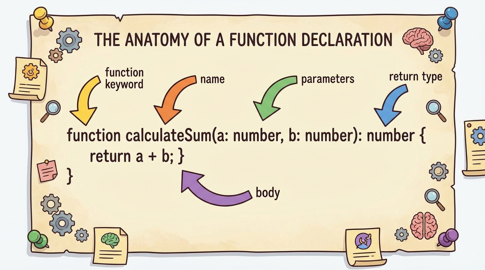
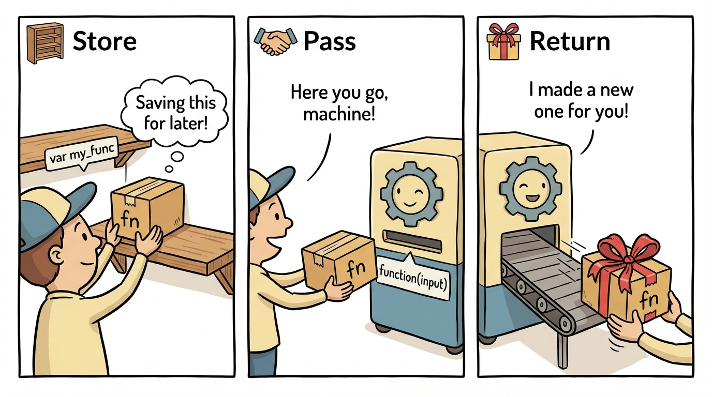
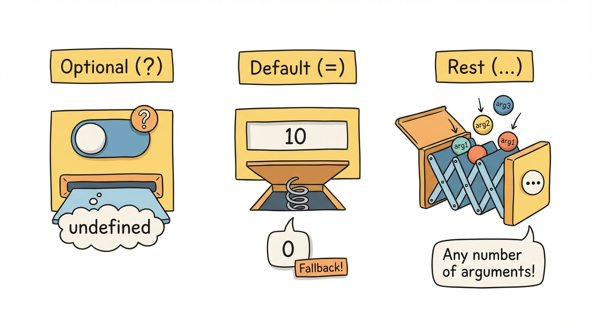

# Module 3: Functions

> 🏷️ Start Here

> 🎯 **Teach:** How to write fully typed function signatures — parameters, return types, and function types as values. **See:** Functions used as first-class values, passed as arguments, and returned from other functions. **Feel:** That functions in TypeScript are not just procedures — they are typed, composable building blocks.

> 🔄 **Where this fits:** Modules 0-2 covered types for data — variables, arrays, tuples, and objects. Now you learn to type the behavior that operates on that data. Functions are where types and logic meet, and typing them correctly is what makes TypeScript code safe to refactor and extend.




## Function Syntax

> 🎯 **Teach:** The core syntax for typing function parameters, return values, optional/default/rest parameters, and arrow functions. **See:** Named functions, arrow functions, and parameter variations — all with explicit type annotations. **Feel:** Grounded in the basic patterns you will use every time you write a typed function.

### The Basics

```typescript
// Named function with types
function add(a: number, b: number): number {
    return a + b;
}

// Arrow function
const multiply = (a: number, b: number): number => a * b;

// Optional parameter
function greet(name: string, greeting?: string): string {
    return `${greeting ?? "Hello"}, ${name}!`;
}

// Default parameter
function power(base: number, exponent: number = 2): number {
    return base ** exponent;
}

// Rest parameters
function sum(...numbers: number[]): number {
    return numbers.reduce((a, b) => a + b, 0);
}
```


## Function Types

> 🎯 **Teach:** How functions are first-class values with their own type signatures, and how to create type aliases for function types. **See:** Function type annotations, type aliases like `MathOp`, and the distinction between `void` and `never` return types. **Feel:** That functions are not just procedures — they are typed values you can assign, pass, and compose.



### Functions as Values

> 🎙️ In TypeScript, functions are first-class values. That means you can assign a function to a variable, pass it as an argument to another function, and return it from a function — just like you would with a number or a string. The key insight is that functions have types, just like data does. A function type describes the shape of the function: what parameters it accepts and what it returns. You can create type aliases for function types, which makes your code cleaner and lets you reuse the same signature in multiple places.

```typescript
// Function type annotation
let operation: (a: number, b: number) => number;
operation = add;
operation = multiply;
// operation = greet;  // Error: signature doesn't match

// Type alias for function types
type MathOp = (a: number, b: number) => number;
const subtract: MathOp = (a, b) => a - b;
```

### Void vs Never

```typescript
function log(msg: string): void { console.log(msg); }  // Returns undefined
function fail(msg: string): never { throw new Error(msg); } // Never returns
```

---

## Basic Functions

> 🎯 **Teach:** How to write and call fully typed functions with different parameter and return types. **See:** Five functions — add, isEven, reverse, maxOfThree, repeat — each with explicit parameter and return type annotations. **Feel:** Comfortable writing typed functions from scratch and testing them with console output.

Before we get to clever features like generics or higher-order functions, it helps to practice the plain case: a function with typed parameters and a typed return. The five small functions below are everyday utilities — add two numbers, test for even, reverse a string, find the max, repeat text. None of them is interesting on its own. What is interesting is the **discipline** of annotating every input and output, because that discipline is what makes the rest of the type system work.

Every one of these signatures tells the compiler two things: what shape of data the function accepts, and what shape of data it promises to return. `function add(a: number, b: number): number` says "give me two numbers and I will return a number." If a caller passes a string, TypeScript rejects the call at compile time. If the function body tries to return a string, TypeScript rejects the function at compile time. You get a two-sided contract: the callers are checked against the signature, and the implementation is checked against the signature. That is why typed functions are the foundation of refactor-safe code — changing the signature propagates errors to every wrong use instantly.

For return types specifically, TypeScript can almost always infer what a function returns. `function add(a: number, b: number)` without the return annotation still types the function correctly. But writing the return type explicitly has two benefits: it documents intent, and it turns the function body into a checked implementation of that contract. If you change the body and accidentally start returning something different, TypeScript catches the mistake instead of silently updating the inferred return type and spreading the confusion to every caller. For exported functions especially, annotate the return explicitly.

Pitfall to watch: beginners sometimes write `function add(a, b)` with no annotations at all. With strict mode enabled, TypeScript flags this as "implicit any" on the parameters — your function has silently opted out of type checking for its inputs. The fix is always to annotate. The fluent patterns you will see later (arrow functions, callbacks) still require this discipline; they just hide the annotations in more convenient places.

### Program A: basic_functions.ts

Write typed functions and call each one:

```typescript
function add(a: number, b: number): number {
    return a + b;
}

function isEven(n: number): boolean {
    return n % 2 === 0;
}

function reverse(s: string): string {
    return s.split("").reverse().join("");
}

function maxOfThree(a: number, b: number, c: number): number {
    return Math.max(a, b, c);
}

function repeat(text: string, times: number): string {
    return text.repeat(times);
}

// Test them all
console.log(`add(3, 4) = ${add(3, 4)}`);
console.log(`isEven(7) = ${isEven(7)}`);
console.log(`reverse("TypeScript") = ${reverse("TypeScript")}`);
console.log(`maxOfThree(5, 9, 3) = ${maxOfThree(5, 9, 3)}`);
console.log(`repeat("ha", 3) = ${repeat("ha", 3)}`);
```

### What to notice

- **Every function has explicit parameter types *and* an explicit return type.** The return types are technically redundant here because TypeScript could infer them, but writing them out catches silent changes if you later modify the body.
- **`reverse(s: string): string` works by splitting, reversing, and joining** — pure string operations, all tracked by the type system. If you accidentally called `.reverse()` on the string directly (which is not a string method), TypeScript would catch the mistake immediately.
- **`Math.max(a, b, c)` is already typed in the standard library**, so its return type flows naturally into `maxOfThree`'s return. You rarely have to reach for `any` when composing typed standard-library functions.

---

## Optional, Default, and Rest Parameters

> 🎯 **Teach:** How optional (`?`), default (`= value`), and rest (`...args`) parameters make functions flexible while staying type-safe. **See:** Functions that omit arguments, use defaults, accept variable-length argument lists, and combine all three patterns. **Feel:** Confident designing function signatures that are both flexible and safe.

Real functions are rarely as tidy as the five-line examples above. You usually want one or two of the arguments to be optional, or you want a sensible default if the caller does not provide one, or you want to accept an unknown number of inputs. TypeScript gives you three tools for exactly these situations: **optional parameters** (marked with `?`), **default parameters** (with `= value`), and **rest parameters** (with `...args`). They cover the full flexibility spectrum without forcing you to fall back on `any`.

An optional parameter is one the caller can skip entirely. Inside the function, an omitted parameter is `undefined` — so a parameter typed `email?: string` actually has the type `string | undefined`, and you must guard against the missing case before using it. A default parameter goes one step further: you name a specific value the function should use when the caller skips the argument. This gives you the same flexibility but removes the `| undefined` from the parameter's type, so you do not need to guard inside the body. Use optional when `undefined` is a meaningful signal; use default when a single sensible fallback always applies.

Rest parameters let a function accept any number of arguments of the same type. The syntax `...numbers: number[]` collects every trailing argument into an array. This is how `console.log` and `Math.max` work under the hood — they do not declare nine separate parameters, they declare one rest parameter. Rest parameters must be the *last* parameter in the signature; you cannot have required arguments after a rest, because there would be no way to tell them apart from the collected values.

When you combine all three (as `buildUrl` does below), the order matters: required parameters first, optional/default ones in the middle, rest parameter at the end. This mirrors how JavaScript binds arguments positionally. A frequent beginner pitfall is writing `function f(a?: string, b: number)` — putting an optional parameter before a required one. TypeScript flags this because there is no way to pass only `b` without also specifying something for `a`. The remedy is either to make `b` optional too, or to swap the order.

### Program B: parameters.ts

```typescript
// Optional parameter
function createUser(name: string, email?: string): string {
    if (email) {
        return `${name} <${email}>`;
    }
    return name;
}

console.log(createUser("Campbell"));
console.log(createUser("Campbell", "campbell@example.com"));

// Default parameter
function formatCurrency(amount: number, currency: string = "USD", decimals: number = 2): string {
    return `${amount.toFixed(decimals)} ${currency}`;
}

console.log(formatCurrency(42.5));
console.log(formatCurrency(42.5, "EUR"));
console.log(formatCurrency(42.5, "JPY", 0));

// Rest parameters
function average(...nums: number[]): number {
    return nums.reduce((a, b) => a + b, 0) / nums.length;
}

console.log(`Average: ${average(10, 20, 30, 40, 50)}`);

// Combining all three
function buildUrl(
    base: string,
    path: string = "/",
    ...queryParams: string[]
): string {
    let url = `${base}${path}`;
    if (queryParams.length > 0) {
        url += `?${queryParams.join("&")}`;
    }
    return url;
}

console.log(buildUrl("https://api.example.com"));
console.log(buildUrl("https://api.example.com", "/users"));
console.log(buildUrl("https://api.example.com", "/search", "q=typescript", "page=1"));
```

### What to notice

- **`createUser` types `email?` as optional.** Inside the body, `email` has type `string | undefined` — the `if (email)` guard narrows it to `string` before use. Without the guard, calling `.length` on `email` would be a compile error.
- **`formatCurrency` uses defaults instead of optionals.** Because every omitted argument has a concrete fallback, the parameter types inside the body are `string` and `number` (no `| undefined`). Defaults are usually cleaner than optional + guard when a sensible fallback exists.
- **`buildUrl` mixes required, default, and rest parameters in order.** Rest must come last — `...queryParams: string[]` collects everything trailing after `path`.
- **Optionals cannot precede required parameters.** Writing `function f(a?: string, b: number)` is a compile error because there is no way to pass `b` without also providing `a`.

---

## Arrow Functions and Callbacks

> 🎯 **Teach:** How arrow functions work as callbacks in higher-order functions like map, filter, reduce, and sort — with types flowing automatically. **See:** Arrow functions passed to array methods, typed comparators for sorting, and a custom higher-order function that accepts a callback. **Feel:** Fluent with the functional programming patterns that make TypeScript code concise and expressive.


### Higher-Order Functions

> 🎙️ A higher-order function is a function that takes another function as a parameter or returns a function as its result. This is one of the most powerful patterns in TypeScript. Array methods like map, filter, and reduce are higher-order functions — they take a callback function that you provide. TypeScript types flow through these seamlessly: when you call `numbers.filter(n => n > 5)`, TypeScript knows `n` is a number because `numbers` is a `number[]`. You get full type safety inside your callbacks without writing a single annotation.

### Program C: arrows.ts

```typescript
// Arrow function variations
const double = (n: number): number => n * 2;
const greet = (name: string): string => `Hello, ${name}!`;
const isPositive = (n: number): boolean => n > 0;

// Arrow functions shine as callbacks
const numbers = [1, 2, 3, 4, 5, 6, 7, 8, 9, 10];

const evens = numbers.filter(n => n % 2 === 0);
const squared = numbers.map(n => n ** 2);
const sum = numbers.reduce((acc, n) => acc + n, 0);

console.log(`Evens: ${evens}`);
console.log(`Squared: ${squared}`);
console.log(`Sum: ${sum}`);

// Sorting with typed comparators
const words = ["banana", "apple", "cherry", "date"];
const sorted = [...words].sort((a, b) => a.localeCompare(b));
const byLength = [...words].sort((a, b) => a.length - b.length);

console.log(`Alphabetical: ${sorted}`);
console.log(`By length: ${byLength}`);

// Higher-order function
function applyOperation(a: number, b: number, op: (x: number, y: number) => number): number {
    return op(a, b);
}

console.log(`Add: ${applyOperation(10, 5, (a, b) => a + b)}`);
console.log(`Multiply: ${applyOperation(10, 5, (a, b) => a * b)}`);
console.log(`Power: ${applyOperation(2, 10, (a, b) => a ** b)}`);
```

---

## Function Types

> 🎯 **Teach:** How to define reusable function type aliases and use them to type parameters, variables, and return values. **See:** Type aliases like `Predicate`, `Transform`, and `Combiner` used to type filter functions, and a factory function that returns a new function. **Feel:** That function types are a powerful abstraction — you can describe the shape of behavior just like you describe the shape of data.

Once you accept that functions are values, the natural next step is to give their types *names*. Writing `(value: number) => boolean` over and over gets tedious, and more importantly the repeated signature invites mistakes — you change one copy and forget the others. A type alias lets you name the signature once and reuse it everywhere: `type Predicate = (value: number) => boolean`. From that moment on, any function that takes a number and returns a boolean can be assigned to a `Predicate`, and any parameter annotated with `Predicate` accepts any such function.

This is exactly what the standard library does internally. `Array.prototype.filter` is typed to take a predicate; `Array.prototype.map` takes a transform. Giving your own function types names does two things. First, it makes your function signatures dramatically more readable — `filterNumbers(nums: number[], predicate: Predicate)` tells the reader what the second argument *means*, not just what its shape is. Second, it keeps your type definitions DRY — if you later decide a predicate should also return `null` for "skip," you change the alias once and every use site updates.

The factory-function pattern in the second half of the program shows a more advanced use of function types: a function that *returns* another function. `createMultiplier(factor: number): (n: number) => number` announces in its signature that it gives you back a function that takes a number and returns a number. TypeScript's type inference is strong enough that the returned function's body does not need any annotations — TypeScript sees the declared return type and types the arrow function's parameters for you. This pattern appears constantly in React (`useCallback` returns a memoized function), in currying, and in dependency injection.

Pitfall to watch: type aliases and interfaces can both describe object shapes, but **only type aliases can describe function signatures, union types, and tuples**. If you find yourself wanting `interface Predicate extends (value: number) => boolean`, stop — that syntax does not exist. Use `type` for function types. (There is a second way to put a function signature on an interface, as a callable signature, but it is reserved for the hybrid objects you saw in the interface chapter preview.)

### Program D: function_types.ts

```typescript
// Function type alias
type Predicate = (value: number) => boolean;
type Transform = (value: string) => string;
type Combiner = (a: number, b: number) => number;

// Use function types
const isEven: Predicate = n => n % 2 === 0;
const isPositive: Predicate = n => n > 0;
const toUpper: Transform = s => s.toUpperCase();
const add: Combiner = (a, b) => a + b;

// Function that accepts function types
function filterNumbers(nums: number[], predicate: Predicate): number[] {
    return nums.filter(predicate);
}

const data = [-3, -1, 0, 2, 4, 7, 8, 11];
console.log(`Evens: ${filterNumbers(data, isEven)}`);
console.log(`Positives: ${filterNumbers(data, isPositive)}`);
console.log(`Even AND positive: ${filterNumbers(data, n => isEven(n) && isPositive(n))}`);

// Returning functions
function createMultiplier(factor: number): (n: number) => number {
    return (n) => n * factor;
}

const triple = createMultiplier(3);
const tenX = createMultiplier(10);
console.log(`Triple 5: ${triple(5)}`);
console.log(`10x 7: ${tenX(7)}`);
```

### What to notice

- **`isEven: Predicate = n => n % 2 === 0` has no annotation on `n`.** TypeScript infers `n: number` from the `Predicate` alias. Naming the function type pays you back in concision at every use site.
- **`filterNumbers` advertises `predicate: Predicate` in its signature.** That is semantic documentation — the reader knows what role the argument plays without reading the body.
- **`createMultiplier` declares its return type as `(n: number) => number`.** Because the return type is declared, the arrow function inside does not need its own annotations. This is the same contextual typing you saw with array `.map` callbacks.

---

## Practical Application: Calculator

> 🎯 **Teach:** How to combine function types, `Record`, and control flow to build a real calculator with typed operations. **See:** A `Record<string, Operation>` that maps operator strings to typed functions, with a `calculate` function dispatching to the correct operation. **Feel:** That typed functions and data structures work together to create clean, extensible programs.

This exercise ties together every idea from the module. A calculator is almost the ideal domain for typed functions: the core operation — take two numbers, return a number — is exactly a function type, and the dispatch from operator string to implementation is a perfect fit for a typed object. The pattern shown here — a `Record<string, Operation>` mapping operator keys to typed functions — is a lightweight **strategy pattern**. Each operation is a self-contained function, the registry holds them by name, and the dispatcher looks them up at runtime.

Notice how small and declarative the result is. Adding a new operator means adding one line to the `operations` map — no changes to `calculate`, no conditional logic, no modification-of-existing-functions risk. That is because the *shape* of an operation is nailed down by the `Operation` type alias. Every function in the registry has to satisfy `(a: number, b: number) => number`. If you tried to register a function with the wrong signature, TypeScript would reject it at the literal, not at some distant call site. This is how you get the flexibility of lookup-table dispatch *with* the safety of static typing.

The tuple `[number, string, number]` in the `tests` array carries a different lesson. Its second slot is typed as `string`, which accepts any operator — valid or not. Inside `calculate` the guard `if (!operation)` handles unknown operators gracefully. If you wanted to tighten this up, you could replace `string` with a union of literal types: `type Op = "+" | "-" | "*" | "/" | "**" | "%"`, and then `calculate` could never be called with a typo. The trade-off is that adding a new operator would require updating the union, which is exactly what you want in a production codebase.

Pitfall to watch: `Record<string, Operation>` says *any* string might be a key — accessing an unknown key returns `Operation | undefined`. In some strict configurations (with `noUncheckedIndexedAccess`) TypeScript would require the guard; without that flag, TypeScript lets you forget and run into a runtime crash. When you build lookup tables, always check that the lookup succeeded before calling the result.

### Program E: calculator.ts

Build a typed calculator with function types:

```typescript
type Operation = (a: number, b: number) => number;

const operations: Record<string, Operation> = {
    "+": (a, b) => a + b,
    "-": (a, b) => a - b,
    "*": (a, b) => a * b,
    "/": (a, b) => {
        if (b === 0) throw new Error("Division by zero");
        return a / b;
    },
    "**": (a, b) => a ** b,
    "%": (a, b) => a % b,
};

function calculate(a: number, op: string, b: number): number {
    const operation = operations[op];
    if (!operation) {
        throw new Error(`Unknown operator: ${op}`);
    }
    return operation(a, b);
}

// Test all operations
const tests: [number, string, number][] = [
    [10, "+", 5],
    [10, "-", 3],
    [4, "*", 7],
    [20, "/", 4],
    [2, "**", 8],
    [17, "%", 5],
];

for (const [a, op, b] of tests) {
    console.log(`${a} ${op} ${b} = ${calculate(a, op, b)}`);
}
```

### What to notice

- **`type Operation = (a: number, b: number) => number` is the contract every operation must satisfy.** Try changing `"+": (a, b) => a.toString()` — TypeScript rejects it at the literal, not at the call site.
- **`operations[op]` can return `undefined`** when the key is not in the map. The `if (!operation) throw ...` guard converts that possibility into a typed error. Without the guard, you would get a runtime `TypeError: operation is not a function` that the compiler failed to anticipate.
- **The tests array is typed `[number, string, number][]`**, so each tuple element destructures with the right type. If you constrained the middle element to the literal union `"+" | "-" | "*" | "/" | "**" | "%"`, typos would become compile errors.

---

## Sharpen Your Pencil

> 🎯 **Teach:** How to apply function syntax, parameter patterns, arrow functions, function types, and real-world composition through hands-on practice. **See:** Five exercises building from basic typed functions to a full calculator application. **Feel:** Capable of writing each program independently, solidifying every function concept from this module.

> ✏️ Sharpen Your Pencil




1. Write `basic_functions.ts` with at least 5 typed functions (different parameter types and return types). Call each one and log the result.
2. Write `parameters.ts` demonstrating optional parameters, default parameters, rest parameters, and a function that combines all three.
3. Write `arrows.ts` using arrow functions as callbacks with `filter`, `map`, `reduce`, and `sort`. Write a higher-order function that accepts a callback.
4. Write `function_types.ts` with type aliases for function types. Write a function that accepts a function parameter and one that returns a function.
5. Write `calculator.ts` using a `Record<string, Operation>` to map operator strings to typed functions. Test all operations.

---

> 💡 **Remember this one thing:** Functions are first-class values in TypeScript — you can type them, pass them, and return them just like data.

---

## Up Next

> 🎯 **Teach:** What comes next in the learning path and how it builds on typed functions. **See:** A preview of Module 4's focus on conditionals, loops, and type narrowing through control flow. **Feel:** Eager to learn how TypeScript uses your logic to get smarter about types.

In **Module 4: Control Flow**, you will learn how TypeScript uses conditionals, loops, and iteration methods — and how control flow enables type narrowing, where TypeScript tracks what type a variable could be at each point in your code.
