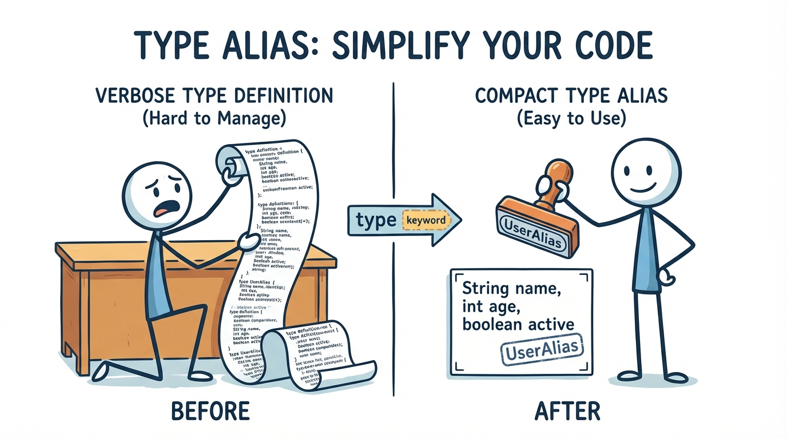
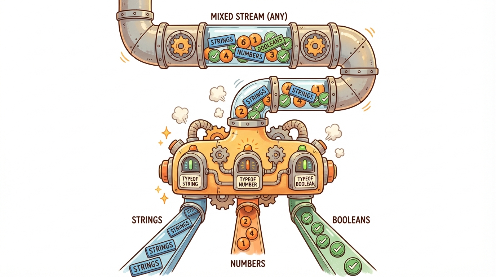
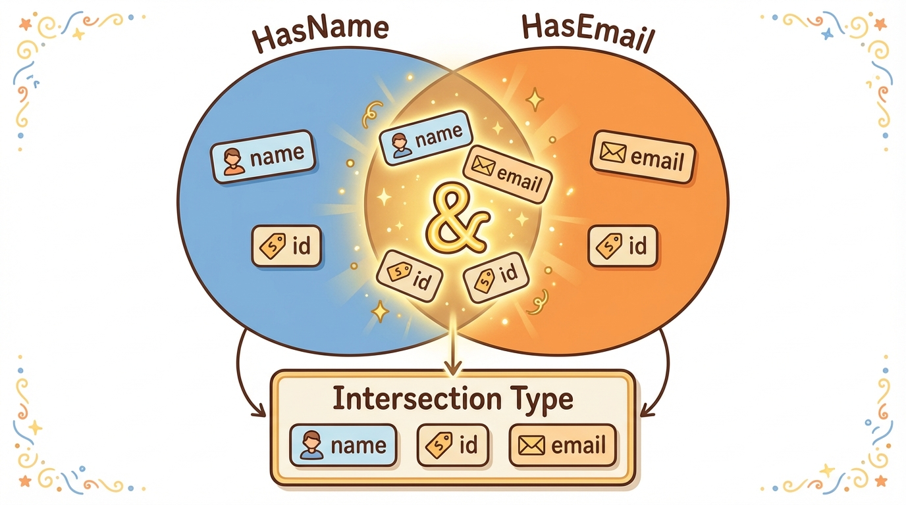
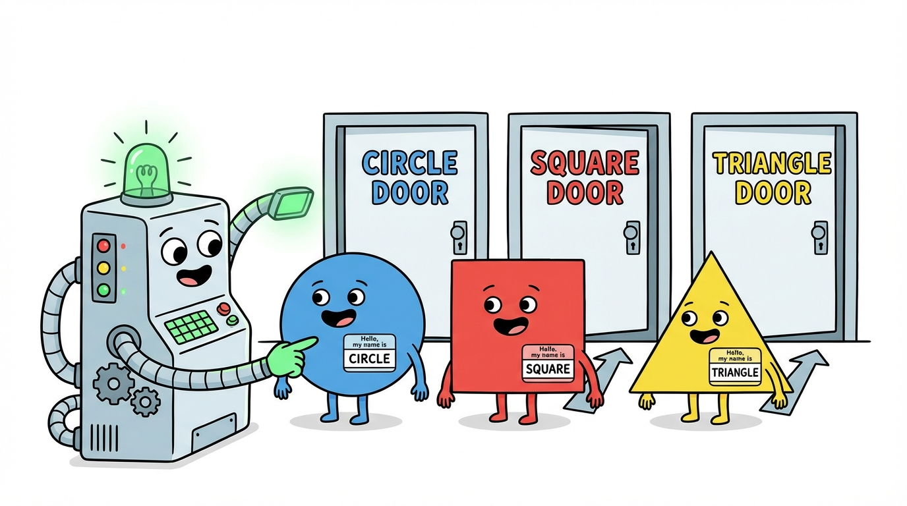

# Module 5: Type Aliases and Union Types






## Introduction

> 🏷️ Useful Soon

> 🎙️ So far you've been annotating variables with built-in types like string, number, and boolean. But real programs have richer shapes -- a user ID might be a string or a number, a function might return success data or an error, and an event system might handle clicks, keypresses, scrolls, and resizes all through the same pipeline. TypeScript gives you three tools for modeling these situations: type aliases that give names to complex types, union types that say "this or that," and intersection types that say "this and that." Today you'll use all three, and you'll learn the discriminated union pattern -- one of the most important patterns in TypeScript.

> 🎯 **Teach:** How to define type aliases, union types, intersection types, and discriminated unions.
> **See:** TypeScript narrowing union types inside switch statements, and the discriminated union pattern applied to shapes and API responses.
> **Feel:** That the type system is a design tool, not just an error checker -- it models the actual shape of your data.

> 🔄 **Where this fits:** You've learned primitive types, arrays, tuples, objects, functions, and control flow. Type aliases and unions let you compose those building blocks into richer, more precise types that reflect how your data actually works.






## Type Aliases

> 🎯 **Teach:** How to create named shortcuts for complex type expressions using the `type` keyword. **See:** Aliases for primitives, unions, tuples, objects, and function signatures, plus composing types with intersections. **Feel:** That naming your types makes code self-documenting and keeps complex type expressions from cluttering every variable declaration.

> 🎙️ A type alias gives a name to any type expression. It doesn't create a new type -- it's just a convenient shorthand. You can alias primitives, unions, tuples, objects, and function signatures. Once you define an alias, you use it exactly like a built-in type.

A `type` alias creates a name for any type:

```typescript
type UserID = number;
type Username = string;
type Point = { x: number; y: number };
type StringOrNumber = string | number;
```

### Program A: type_aliases.ts

```typescript
// Simple aliases
type ID = string | number;
type Coordinate = [number, number];
type Callback = (data: string) => void;

// Object type alias
type User = {
    id: ID;
    name: string;
    email: string;
    age: number;
    active: boolean;
};

// Using the aliases
const user1: User = { id: 1, name: "Alice", email: "alice@example.com", age: 25, active: true };
const user2: User = { id: "u-002", name: "Bob", email: "bob@example.com", age: 30, active: false };

const origin: Coordinate = [0, 0];
const target: Coordinate = [10, 20];

function distance(a: Coordinate, b: Coordinate): number {
    return Math.sqrt((b[0] - a[0]) ** 2 + (b[1] - a[1]) ** 2);
}

console.log(`User: ${user1.name} (ID: ${user1.id})`);
console.log(`Distance: ${distance(origin, target).toFixed(2)}`);

// Nested type aliases
type Address = { street: string; city: string; state: string; zip: string };
type Employee = User & { department: string; address: Address };

const emp: Employee = {
    id: 1, name: "Campbell", email: "campbell@example.com", age: 20, active: true,
    department: "Engineering",
    address: { street: "123 Main", city: "Austin", state: "TX", zip: "78701" },
};

console.log(`${emp.name} works in ${emp.department}, lives in ${emp.address.city}`);
```

Notice how `Employee` uses an intersection (`&`) to combine `User` with additional fields. Type aliases compose naturally.

## Union Types

> 🎯 **Teach:** How union types let a value be one of several types, and how TypeScript narrows unions through `typeof` checks and control flow. **See:** Basic unions with `string | number`, literal unions like `Direction`, and nullable return types with `User | null`. **Feel:** That unions give you precision -- you can say exactly which values are allowed instead of reaching for a vague `string` or `any`.

> 🎙️ A union type says a value can be one of several types. The pipe symbol means "or." When you have a union, TypeScript only lets you access properties that exist on all members of the union -- unless you narrow it first. The most common way to narrow is with typeof checks, which TypeScript understands and tracks through your control flow.

A value that can be one of several types:

```typescript
let id: string | number;
id = "abc-123";  // OK
id = 42;         // OK
// id = true;    // Error
```

### Program B: unions.ts

```typescript
// Basic union
function formatId(id: string | number): string {
    if (typeof id === "string") {
        return id.toUpperCase();
    }
    return `#${id.toString().padStart(5, "0")}`;
}

console.log(formatId("abc-123"));
console.log(formatId(42));

// Literal unions
type Direction = "north" | "south" | "east" | "west";
type HttpMethod = "GET" | "POST" | "PUT" | "DELETE";
type Status = "pending" | "active" | "completed" | "cancelled";

function move(direction: Direction, steps: number): string {
    return `Moving ${steps} steps ${direction}`;
}

console.log(move("north", 5));
// move("up", 3);  // Error: "up" is not assignable to Direction

// Union with null/undefined
function findUser(id: number): User | null {
    if (id === 1) return { id: 1, name: "Alice", email: "a@b.com", age: 25, active: true };
    return null;
}

const found = findUser(1);
if (found) {
    console.log(`Found: ${found.name}`);  // TypeScript knows found is User here
}

type User = { id: number; name: string; email: string; age: number; active: boolean };
```

Literal unions like `Direction` constrain a value to specific strings. This is far more precise than typing it as `string`.

## Discriminated Unions

> 🎯 **Teach:** The discriminated union pattern -- a union of object types sharing a literal "tag" field that TypeScript uses for automatic narrowing. **See:** Shape types narrowed by a `kind` field in a switch statement, and API responses narrowed by a `status` field. **Feel:** That this one pattern is the most important thing in the module -- it shows up everywhere in real codebases and makes complex branching logic completely type-safe.

> 🎙️ Here is the most important pattern in this module. A discriminated union is a union of object types that all share a common "tag" field -- a literal-typed property like kind or status or type. When you switch on that tag field, TypeScript knows exactly which variant you're dealing with inside each case. It narrows the type automatically. This pattern shows up everywhere: shapes, API responses, event systems, state machines, Redux actions. Learn it once and you'll recognize it constantly.

Union types with a shared "tag" field for safe narrowing:

```typescript
type Circle = { kind: "circle"; radius: number };
type Rectangle = { kind: "rectangle"; width: number; height: number };
type Shape = Circle | Rectangle;

function area(shape: Shape): number {
    switch (shape.kind) {
        case "circle": return Math.PI * shape.radius ** 2;
        case "rectangle": return shape.width * shape.height;
    }
}
```

The `kind` field is the discriminant. TypeScript narrows the type inside each `case` branch, giving you access to the correct fields.

### Program C: discriminated_unions.ts

```typescript
// Shape hierarchy using discriminated unions
type Circle = { kind: "circle"; radius: number };
type Rectangle = { kind: "rectangle"; width: number; height: number };
type Triangle = { kind: "triangle"; base: number; height: number };
type Shape = Circle | Rectangle | Triangle;

function area(shape: Shape): number {
    switch (shape.kind) {
        case "circle":
            return Math.PI * shape.radius ** 2;
        case "rectangle":
            return shape.width * shape.height;
        case "triangle":
            return 0.5 * shape.base * shape.height;
    }
}

function describe(shape: Shape): string {
    switch (shape.kind) {
        case "circle":
            return `Circle with radius ${shape.radius}`;
        case "rectangle":
            return `${shape.width}x${shape.height} Rectangle`;
        case "triangle":
            return `Triangle with base ${shape.base} and height ${shape.height}`;
    }
}

const shapes: Shape[] = [
    { kind: "circle", radius: 5 },
    { kind: "rectangle", width: 10, height: 4 },
    { kind: "triangle", base: 8, height: 6 },
];

for (const shape of shapes) {
    console.log(`${describe(shape)} → Area: ${area(shape).toFixed(2)}`);
}

// API response pattern
type SuccessResponse = { status: "success"; data: string[]; count: number };
type ErrorResponse = { status: "error"; message: string; code: number };
type ApiResponse = SuccessResponse | ErrorResponse;

function handleResponse(response: ApiResponse): void {
    switch (response.status) {
        case "success":
            console.log(`Got ${response.count} items: ${response.data.join(", ")}`);
            break;
        case "error":
            console.log(`Error ${response.code}: ${response.message}`);
            break;
    }
}

handleResponse({ status: "success", data: ["a", "b", "c"], count: 3 });
handleResponse({ status: "error", message: "Not found", code: 404 });
```

The same pattern applies to API responses: the `status` field is the discriminant, and TypeScript narrows `data`/`count` vs `message`/`code` automatically.

## Intersection Types

> 🎯 **Teach:** How intersection types combine multiple types into one using `&`, giving you all properties from every constituent type. **See:** Small reusable type fragments like `Timestamped`, `SoftDeletable`, and `Identifiable` composed into a `BaseEntity`, then extended further into `BlogPost`. **Feel:** That intersections are the composition tool for types -- you build complex types from simple, reusable pieces instead of repeating yourself.

> 🎙️ If unions mean "or," intersections mean "and." An intersection type combines multiple types into one that has all of their properties. This is useful for composing reusable type fragments -- things like timestamps, soft-delete flags, and identifiers -- into larger types without repeating yourself.

Combine multiple types into one with `&`:

```typescript
type HasName = { name: string };
type HasAge = { age: number };
type Person = HasName & HasAge; // Must have both name AND age
```

### Program D: intersections.ts

```typescript
type Timestamped = { createdAt: Date; updatedAt: Date };
type SoftDeletable = { deleted: boolean; deletedAt?: Date };
type Identifiable = { id: string };

// Combine with intersection
type BaseEntity = Identifiable & Timestamped & SoftDeletable;

type BlogPost = BaseEntity & {
    title: string;
    content: string;
    author: string;
    tags: string[];
};

const post: BlogPost = {
    id: "post-001",
    createdAt: new Date(),
    updatedAt: new Date(),
    deleted: false,
    title: "Learning TypeScript",
    content: "TypeScript is great!",
    author: "Campbell",
    tags: ["typescript", "programming"],
};

console.log(`[${post.id}] ${post.title} by ${post.author}`);
console.log(`Tags: ${post.tags.join(", ")}`);
console.log(`Created: ${post.createdAt.toISOString()}`);

// Intersection with functions
type Loggable = { log: () => void };
type Serializable = { serialize: () => string };

type LoggablePost = BlogPost & Loggable & Serializable;
```

`BaseEntity` composes three small types into one reusable foundation. `BlogPost` then extends that foundation with domain-specific fields. This is how you build up complex types from simple pieces.

## Practical Exercise: Event System

> 🎯 **Teach:** How to apply discriminated unions to a real-world event system that handles multiple event types through a single handler. **See:** Click, keypress, scroll, and resize events unified under one `AppEvent` union, dispatched through a switch on the `type` discriminant. **Feel:** Confident that you can model any multi-variant system -- DOM events, Redux actions, message queues -- using the discriminated union pattern you just learned.

> ✏️ Sharpen Your Pencil

> 🎙️ Now put it all together. This exercise uses discriminated unions to model a typed event system -- the same pattern that powers DOM events, Redux actions, and message-passing architectures. Each event type has a shared type field as its discriminant, plus fields specific to that kind of event. The handler function switches on the discriminant and TypeScript narrows inside each case.

Build a typed event system using discriminated unions:

### Program E: event_system.ts

```typescript
type ClickEvent = { type: "click"; x: number; y: number; button: "left" | "right" };
type KeyEvent = { type: "keypress"; key: string; shift: boolean; ctrl: boolean };
type ScrollEvent = { type: "scroll"; deltaX: number; deltaY: number };
type ResizeEvent = { type: "resize"; width: number; height: number };
type AppEvent = ClickEvent | KeyEvent | ScrollEvent | ResizeEvent;

function handleEvent(event: AppEvent): string {
    switch (event.type) {
        case "click":
            return `${event.button} click at (${event.x}, ${event.y})`;
        case "keypress":
            const mods = [event.ctrl ? "Ctrl" : "", event.shift ? "Shift" : ""].filter(Boolean).join("+");
            return `Key: ${mods ? mods + "+" : ""}${event.key}`;
        case "scroll":
            return `Scroll: dx=${event.deltaX}, dy=${event.deltaY}`;
        case "resize":
            return `Resize: ${event.width}x${event.height}`;
    }
}

const events: AppEvent[] = [
    { type: "click", x: 100, y: 200, button: "left" },
    { type: "keypress", key: "s", shift: false, ctrl: true },
    { type: "scroll", deltaX: 0, deltaY: -120 },
    { type: "resize", width: 1920, height: 1080 },
    { type: "keypress", key: "A", shift: true, ctrl: false },
];

for (const event of events) {
    console.log(`[${event.type}] ${handleEvent(event)}`);
}
```

> 💡 **Remember this one thing:** Discriminated unions let TypeScript narrow types safely using a shared tag field.

## Up Next

> 🎯 **Teach:** Where you are headed next and how it connects to what you just learned. **See:** A preview of interfaces as the preferred way to define object shapes, with `extends` for inheritance. **Feel:** Eager to learn the other major tool for defining types, and curious about when to choose `interface` over `type`.

In **Module 6: Interfaces**, you'll learn the other major way to define object shapes in TypeScript -- `interface`. You'll see how interfaces extend each other, support function and index signatures, and when to reach for `interface` versus `type`.
