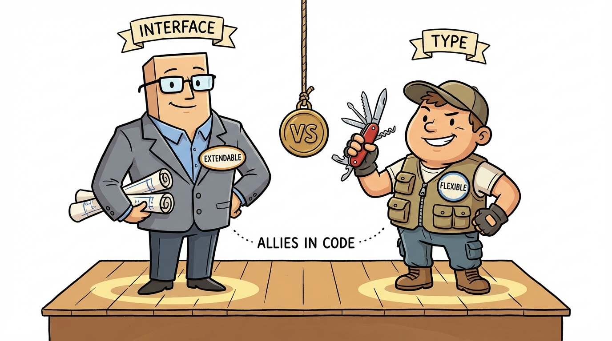
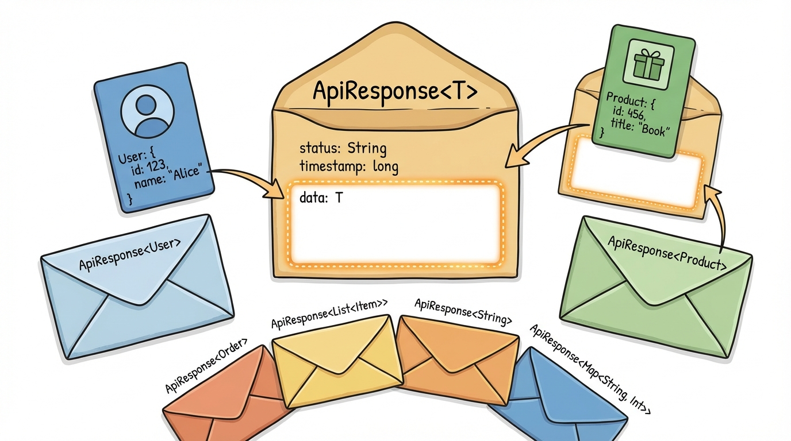
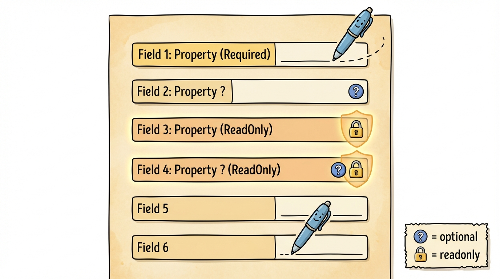
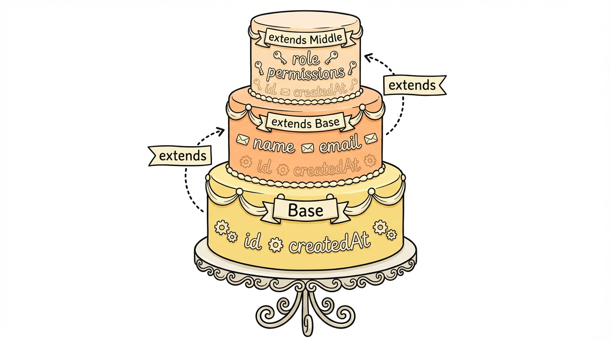

# Module 6: Interfaces




## Introduction

> 🏷️ Useful Soon

> 🎙️ In the last module you used type aliases to define object shapes. TypeScript has a second tool for the same job: interfaces. Interfaces are the preferred way to define object shapes in TypeScript. They support extension with the extends keyword, they auto-merge when declared multiple times, and they make your intent clear -- when someone sees interface, they know it describes the shape of an object. Today you'll define interfaces with optional and readonly properties, extend them through single and multiple inheritance, write function and index signatures, and build generic API response interfaces.

> 🎯 **Teach:** How to define, extend, and implement interfaces, and when to choose interface over type.
> **See:** Interfaces composing through extends, function and index signatures, and generic interfaces for API responses.
> **Feel:** That interfaces are the natural choice for describing object shapes, and that the interface-vs-type decision has a simple rule of thumb.

> 🔄 **Where this fits:** You already know type aliases and union types from Module 5. Interfaces give you a second way to define object shapes -- one that's optimized for extension and declaration merging. In Module 7 you'll see classes that implement interfaces.






## Interfaces

> 🎯 **Teach:** The syntax and core features of interfaces -- properties, optional fields, readonly, extension, and the key differences from type aliases. **See:** An interface with optional and readonly properties, single and multiple inheritance with `extends`, and a comparison table of interface vs type. **Feel:** That interfaces are the natural, idiomatic choice for describing object shapes, and that the decision between interface and type has a simple rule of thumb.

> 🎙️ An interface defines the shape of an object -- what properties it must have, their types, and whether they're optional or readonly. It looks similar to a type alias for an object, but uses the interface keyword. The key difference is that interfaces are designed for extension and merging, which makes them the better choice when you're defining object shapes that other code will build on.

```typescript
interface User {
    id: number;
    name: string;
    email: string;
    age?: number;              // Optional
    readonly createdAt: Date;  // Cannot be changed after creation
}
```

### Extending Interfaces




```typescript
interface Animal { name: string; legs: number; }
interface Dog extends Animal { breed: string; }
// Dog has: name, legs, AND breed
```

### Interface vs Type

| Feature | `interface` | `type` |
|---------|------------|--------|
| Extend/inherit | `extends` | `&` (intersection) |
| Merge declarations | Yes (auto-merges) | No |
| Union types | No | Yes |
| Primitives/tuples | No | Yes |
| Use for objects | Preferred | Also works |

Rule of thumb: Use `interface` for object shapes, `type` for everything else.

### Implementing Interfaces

```typescript
interface Printable {
    toString(): string;
}

class Product implements Printable {
    constructor(public name: string, public price: number) {}
    toString(): string { return `${this.name}: $${this.price}`; }
}
```

## Basic Interfaces

> 🎯 **Teach:** How to define a practical interface with readonly IDs, optional properties, and typed arrays. **See:** A `Product` interface with `readonly id`, optional `tags`, and a function that displays products conditionally based on optional fields. **Feel:** That interfaces make your object shapes explicit and self-documenting -- when you read the interface, you know exactly what a Product looks like.

An interface earns its keep when you apply it to real data. The `Product` example below is deliberately boring — it looks like a row you might fetch from a database or an item coming back from a storefront API. That is exactly why it is a good teaching case. Every real application is built out of records like this, and every one of them has to answer the same three questions that interfaces make explicit: which fields are required, which are optional, and which fields should never change after the object is created.

Look at the `readonly` on `id` first. An `id` is the one field you almost never want to mutate. Once the database assigns it, changing it would silently decouple your object from the record it represents — the kind of bug that is invisible until something downstream corrupts. The `readonly` modifier tells TypeScript to refuse any assignment to that field after construction. It costs you nothing at runtime (readonly is erased during compilation) but catches an entire class of accidents at compile time.

Next, notice the `tags?: string[]` field. The question mark makes the property optional, meaning the object is valid whether `tags` is present or missing entirely. Optional fields are one of the most practical parts of interface design — they let you model data where some records have more information than others without resorting to `null` or sentinel values. Inside `displayProduct`, the `if (product.tags)` check is what TypeScript calls narrowing: once you enter the if block, TypeScript knows `tags` is definitely a `string[]`, so calling `.join` is safe.

A common pitfall: forgetting that an optional field might be `undefined` and calling a method on it directly. If you wrote `product.tags.join(", ")` without the guard, TypeScript would refuse to compile. That error is the interface earning its keep — it forced you to handle the missing case.

> 🎙️ The Product interface below is the shape of real application data. Notice three decisions baked into it. First, readonly on id. Once a product is created, its id is locked. The compiler will reject any attempt to change it. Second, an optional tags field. Some products have tags, some do not, and the question mark lets both be valid. And third, the typed array of products. TypeScript checks every element against the interface, so you cannot accidentally put a mismatched object into the list. Inside displayProduct, watch how TypeScript narrows the type. The if-check on tags lets the compiler prove that inside the block, tags is definitely a string array and join is safe to call. That is what a well-designed interface gives you: a compile-time proof that your code handles the optional fields correctly.

### Program A: basic_interfaces.ts

```typescript
interface Product {
    readonly id: number;
    name: string;
    price: number;
    category: string;
    inStock: boolean;
    tags?: string[];
}

function displayProduct(product: Product): void {
    console.log(`[${product.id}] ${product.name} — $${product.price.toFixed(2)}`);
    console.log(`  Category: ${product.category}, In Stock: ${product.inStock}`);
    if (product.tags) {
        console.log(`  Tags: ${product.tags.join(", ")}`);
    }
}

const products: Product[] = [
    { id: 1, name: "Laptop", price: 999.99, category: "Electronics", inStock: true, tags: ["computer", "portable"] },
    { id: 2, name: "Notebook", price: 4.99, category: "Office", inStock: true },
    { id: 3, name: "Headphones", price: 79.99, category: "Electronics", inStock: false, tags: ["audio"] },
];

products.forEach(displayProduct);

// Readonly prevents modification
// products[0].id = 99;  // Error: Cannot assign to 'id'
products[0].price = 899.99;  // OK — price is not readonly
```

### What to notice

- **The middle product has no `tags` field**, and that is perfectly legal because `tags` is optional. TypeScript checks each object literal against the interface and only flags you if a *required* field is missing.
- **`products[0].price = 899.99` is allowed** even though `products` is declared `const`. The `const` locks the binding (you cannot reassign `products` to a new array), but it does not freeze the elements. Only the `readonly` modifier on `id` does that.
- **The `if (product.tags)` guard is doing double duty** — it is the runtime check that prevents a crash when tags is missing, and it is also the type narrowing that lets TypeScript prove `tags.join` is safe inside the block.

Common pitfall: some developers mark every field `readonly` out of an abundance of caution. Do not. Readonly is a contract — it says "no code in the program should ever change this field." If you mark everything readonly, every update requires rebuilding the whole object, and the modifier stops communicating intent. Use it for identifiers and for values that genuinely should never change.

## Extending Interfaces

> 🎯 **Teach:** How to build interface hierarchies using `extends`, including single inheritance, multi-level inheritance, and extending multiple interfaces at once. **See:** `BaseEntity` extended by `User`, then `AdminUser` adding permissions, and `AuditedUser` extending both `User` and `Auditable`. **Feel:** That interface extension creates clean, composable hierarchies without repeating properties -- each layer adds only what's new.

Real applications almost always have a handful of fields that appear on dozens of record types — `id`, `createdAt`, `updatedAt`, maybe `deleted`, `createdBy`. Without extension, you either copy those fields into every interface (error-prone, tedious) or you write one giant interface and hope nobody adds the wrong field to the wrong record. The `extends` keyword gives you a third option: define the common fields once in a base interface and let other interfaces pull them in by name.

Extension also composes naturally. `User extends BaseEntity` pulls in the timestamp fields; `AdminUser extends User` pulls in everything from both by following the chain. Each layer only declares what is new. When you change `BaseEntity` — say, adding `version: number` — every interface downstream inherits the new field automatically, and any object literal that forgets to provide it becomes a compile error. That is a refactor you can make across a whole codebase with confidence because the type system tracks the dependencies for you.

TypeScript also lets you extend *multiple* interfaces in a single declaration, separated by commas. The `AuditedUser` below extends both `User` and `Auditable`, giving you the union of their fields. This is how you mix in orthogonal concerns — auditability, versioning, soft-delete — without forcing every record into one rigid inheritance tree. If two parents declare a field with incompatible types, TypeScript will flag the conflict at the extension site.

Pitfall to watch: extension feels like class inheritance, but it is not. There is no runtime prototype chain, no `super`, and no shared method implementations. Interfaces describe shapes only. If you want behavior to be inherited alongside shape, that is what classes are for (coming up in Module 7).

> 🎙️ Extension is the reason many teams reach for interface first. With extends, you build a hierarchy of shapes: define the common fields once in BaseEntity, then let User inherit them, then let AdminUser add permissions on top. Each layer adds only what is new. And you can extend multiple interfaces at once — AuditedUser below pulls fields from both User and Auditable. This is how real codebases stay DRY. When you change a base interface, every descendant inherits the change and TypeScript tells you immediately about any object literal that needs updating. That is a refactor you can make with confidence.

### Program B: extending.ts

```typescript
interface BaseEntity {
    id: string;
    createdAt: Date;
    updatedAt: Date;
}

interface User extends BaseEntity {
    name: string;
    email: string;
    role: "admin" | "user" | "guest";
}

interface AdminUser extends User {
    permissions: string[];
    department: string;
}

// Multiple extension
interface Auditable {
    lastModifiedBy: string;
}

interface AuditedUser extends User, Auditable {
    loginCount: number;
}

const admin: AdminUser = {
    id: "admin-001",
    createdAt: new Date(),
    updatedAt: new Date(),
    name: "Alice",
    email: "alice@example.com",
    role: "admin",
    permissions: ["read", "write", "delete"],
    department: "Engineering",
};

const auditedUser: AuditedUser = {
    id: "user-001",
    createdAt: new Date(),
    updatedAt: new Date(),
    name: "Bob",
    email: "bob@example.com",
    role: "user",
    lastModifiedBy: "admin-001",
    loginCount: 42,
};

console.log(`Admin: ${admin.name} (${admin.permissions.join(", ")})`);
console.log(`User: ${auditedUser.name} (logins: ${auditedUser.loginCount})`);
```

### What to notice

- **The object literals contain every inherited field.** There is no free pass just because a field came from a base interface — if `BaseEntity` declares `id`, then every concrete `AdminUser` or `AuditedUser` literal must include it.
- **Order does not matter inside a literal.** You can list `name` before `id`, or permissions before createdAt. TypeScript checks shape, not sequence.
- **`AuditedUser extends User, Auditable` is a single line that merges two shapes.** You can extend as many interfaces as you need, comma-separated. If two parents declare the same field name with compatible types, TypeScript merges them; if the types conflict, you get a clear error at the extension declaration.

## Function and Index Signatures

> 🎯 **Teach:** How interfaces can define method signatures, index signatures for dynamic keys, and callable signatures for function-like objects. **See:** A `Calculator` interface with four methods, a `StringMap` with an index signature, and a `Formatter` that is both callable and has properties. **Feel:** That interfaces go beyond simple data shapes -- they can describe any object contract, including objects that behave like functions or have dynamic keys.

So far we have used interfaces to describe static data — a record with a name, an age, a list of tags. But an interface can describe *any* shape of object, and in JavaScript "object" is a broad category. Objects can contain methods. They can act like dictionaries with unpredictable keys. They can themselves be callable, like functions that also hold properties. Each of these shapes has its own interface syntax, and all three show up regularly in real code — especially when you interact with DOM APIs, HTTP libraries, or anything with a plugin system.

The first form is the **method signature**. Inside an interface, you can list a method by name, with its parameters and return type. The `Calculator` example below declares four methods — add, subtract, multiply, divide — and any object you assign to `Calculator` must provide an implementation for each one. This is how interfaces describe service contracts: you declare the methods the consumer will call, and the implementation can be a plain object, a class instance, or anything else that satisfies the shape.

The second form is the **index signature**. Sometimes you do not know the keys ahead of time — HTTP headers are a good example, because which headers are on a response depends on the server and the request. An index signature says "any string key in this object maps to a value of this type." In the `StringMap` below, `[key: string]: string` means every lookup returns a string. This lets you treat the object like a dictionary while keeping type safety for the values.

The third form is the **callable signature**, written as `(args): return` at the top of an interface body. This describes an object that is itself invokable — you can both call it like a function *and* read its properties. `Formatter` below has a callable part that takes a number and returns a string, plus a `prefix` property that the function uses internally. JavaScript libraries use this pattern constantly: think of jQuery's `$`, which is both a function and an object with methods.

Pitfall to watch: interfaces with an index signature cannot also declare other properties whose types conflict with it. If you write `[key: string]: string` and then try to add `count: number`, TypeScript will refuse — because `count` is a string key, and its value has to satisfy the index signature.

> 🎙️ Interfaces describe three shapes of object beyond plain data. First, method signatures. The Calculator interface declares four methods — add, subtract, multiply, divide — and any object assigned to Calculator must provide all four. Second, index signatures. StringMap below says every string key in the object maps to a string value, giving you a typed dictionary without enumerating every possible key. Third, callable signatures. The Formatter interface describes an object that is itself a function — you can call it like a function, and it also has a prefix property. These three forms mean interfaces can describe almost any object you will encounter, from plain records to the fancy hybrid objects that libraries love to hand you.

### Program C: signatures.ts

```typescript
// Interface with methods
interface Calculator {
    add(a: number, b: number): number;
    subtract(a: number, b: number): number;
    multiply(a: number, b: number): number;
    divide(a: number, b: number): number;
}

const calc: Calculator = {
    add: (a, b) => a + b,
    subtract: (a, b) => a - b,
    multiply: (a, b) => a * b,
    divide: (a, b) => {
        if (b === 0) throw new Error("Division by zero");
        return a / b;
    },
};

console.log(`5 + 3 = ${calc.add(5, 3)}`);
console.log(`10 / 3 = ${calc.divide(10, 3).toFixed(2)}`);

// Index signature — dynamic keys
interface StringMap {
    [key: string]: string;
}

const headers: StringMap = {
    "Content-Type": "application/json",
    "Authorization": "Bearer token123",
};

// Interface for callable objects
interface Formatter {
    (value: number): string;
    prefix: string;
}

const currencyFormatter = ((value: number) => {
    return `${currencyFormatter.prefix}${value.toFixed(2)}`;
}) as Formatter;
currencyFormatter.prefix = "$";

console.log(currencyFormatter(42.5));
```

### What to notice

- **Inside `calc.add`, the parameters `a` and `b` have no annotations** — TypeScript infers them from the `Calculator` interface. This is called contextual typing, and it is one of the nicest payoffs of declaring the interface first.
- **The `StringMap` index signature applies to every string lookup.** If you try to read a key that is not in the literal, TypeScript still gives you `string`. At runtime you would get `undefined`, which is a known soft-spot in index signatures; the `noUncheckedIndexedAccess` compiler option tightens this up by returning `string | undefined` instead.
- **Creating the `Formatter` requires a cast.** The function literal does not know about `prefix` yet, so TypeScript cannot verify the whole shape in one step. You build the function, cast it to `Formatter`, then attach the `prefix` property. This small dance is the idiomatic way to construct callable-plus-properties objects.

## Practical Exercise: Generic API Response Interfaces

> 🎯 **Teach:** How to combine interfaces with generics to build reusable API response types that wrap any data shape with metadata and pagination. **See:** A generic `ApiResponse<T>` interface used for both `TodoItem[]` lists and single `TodoItem | null` lookups, with optional pagination. **Feel:** That generic interfaces are the key to building typed APIs -- you define the wrapper once and reuse it for every endpoint.

> ✏️ Sharpen Your Pencil

Every REST API you will ever talk to wraps its data in an envelope — a status code, a human-readable message, maybe pagination info, maybe a trace id. The envelope is the same shape no matter what kind of record is inside; only the `data` field changes. That is a textbook case for a generic interface. You define the envelope once, leave the data type as a type parameter `T`, and then stamp out a concrete type for each endpoint by filling in `T`.

Generics on interfaces work the same way they do on functions: the angle brackets `<T>` declare a type parameter, and you can use `T` anywhere inside the interface body as a placeholder. When a consumer writes `ApiResponse<TodoItem[]>`, TypeScript substitutes `TodoItem[]` for every `T`, giving you a fully specialized type where `data` is a list of todos. Write `ApiResponse<TodoItem | null>` and `data` becomes either a todo or null — the same envelope, a different payload.

The payoff is enormous once you scale this to a real backend. Every endpoint's response type is a single line: `ApiResponse<User>`, `ApiResponse<Product[]>`, `ApiResponse<Invoice | null>`. Pagination, status codes, error messages — all shared. If you later decide to add a `timestamp` field to every response, you add it to `ApiResponse` once and every endpoint picks it up. This is the same pattern libraries like Axios, tRPC, and SWR use internally to give you typed responses without re-declaring the wrapper for every call.

The `PaginationParams` and `TodoItem` interfaces fill out the example. Notice how `priority: 1 | 2 | 3 | 4 | 5` uses a union of number literals to constrain the field to exactly five valid values — that is a tighter guarantee than plain `number`, and it will stop a caller from passing 0 or 99 at compile time.

> 🎙️ Every REST API wraps its data in an envelope: a status code, a message, maybe pagination, maybe a trace id. The envelope is always the same shape — only the data field changes. That is why ApiResponse is generic. You define it once with a type parameter T, and then any endpoint can return ApiResponse of whatever data type it produces. TodoItem array for a list endpoint, TodoItem or null for a single-item lookup. Same envelope, different payload. This is the pattern behind every typed HTTP client you will ever use.

### Program D: api_types.ts

```typescript
interface PaginationParams {
    page: number;
    limit: number;
    sortBy?: string;
    order?: "asc" | "desc";
}

interface ApiResponse<T> {
    data: T;
    status: number;
    message: string;
    pagination?: {
        total: number;
        page: number;
        pages: number;
    };
}

interface TodoItem {
    id: number;
    title: string;
    completed: boolean;
    priority: 1 | 2 | 3 | 4 | 5;
    dueDate?: string;
}

// Simulate API functions
function getTodos(params: PaginationParams): ApiResponse<TodoItem[]> {
    const todos: TodoItem[] = [
        { id: 1, title: "Learn TypeScript", completed: false, priority: 1 },
        { id: 2, title: "Build a project", completed: false, priority: 2 },
        { id: 3, title: "Write tests", completed: true, priority: 3 },
    ];
    return {
        data: todos,
        status: 200,
        message: "Success",
        pagination: { total: todos.length, page: params.page, pages: 1 },
    };
}

function getTodoById(id: number): ApiResponse<TodoItem | null> {
    return {
        data: id === 1 ? { id: 1, title: "Learn TypeScript", completed: false, priority: 1 } : null,
        status: id === 1 ? 200 : 404,
        message: id === 1 ? "Found" : "Not found",
    };
}

// Use the API
const response = getTodos({ page: 1, limit: 10, sortBy: "priority", order: "asc" });
console.log(`Status: ${response.status}, Items: ${response.data.length}`);
response.data.forEach(todo => {
    const status = todo.completed ? "✓" : "○";
    console.log(`  [${status}] P${todo.priority}: ${todo.title}`);
});

const single = getTodoById(1);
console.log(`\nSingle: ${single.data?.title ?? "Not found"}`);
```

### What to notice

- **`getTodos` returns `ApiResponse<TodoItem[]>` — an envelope around an array.** `getTodoById` returns `ApiResponse<TodoItem | null>` — the same envelope around a nullable single record. One generic interface, two very different endpoints.
- **`response.data.forEach` is type-safe.** Because `T` was filled in as `TodoItem[]`, TypeScript knows `data` is a list and `todo` inside the callback is a `TodoItem`. No casts, no assertions.
- **The optional `pagination` field is respected in both responses.** `getTodos` provides it; `getTodoById` omits it. The question mark on `pagination?` is doing the same job as the optional `tags` field in Program A — letting reality have two legal shapes.
- **`single.data?.title ?? "Not found"`** chains optional chaining with nullish coalescing to handle the case where `data` is `null`. Both operators understand the types produced by the generic substitution.

> 💡 **Remember this one thing:** Use interface for object shapes, type for everything else.

## Up Next

> 🎯 **Teach:** Where you are headed next and how interfaces connect to classes. **See:** A preview of classes implementing interfaces with the `implements` keyword, plus access modifiers and abstract classes. **Feel:** Excited to see how classes bring interfaces to life by bundling data and behavior together.

In **Module 7: Classes**, you'll see how classes implement interfaces using the `implements` keyword, and how TypeScript adds access modifiers, parameter properties, and abstract classes to JavaScript's class syntax.
