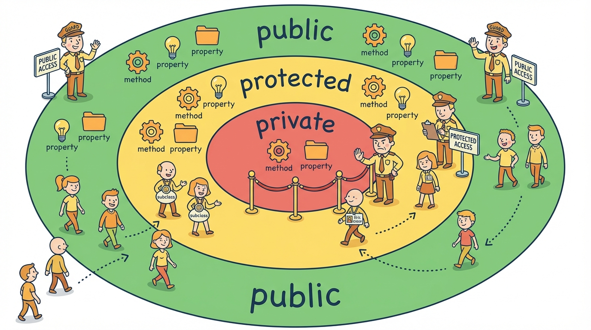

# Module 7: Classes




## Introduction

> 🏷️ Useful Soon

> 🎙️ Classes combine data and behavior into a single unit. JavaScript already has classes, but TypeScript makes them significantly more powerful by adding access modifiers -- public, protected, private, and readonly -- that control who can see and change each property. TypeScript also gives you parameter properties, a shorthand that declares and initializes properties right in the constructor signature, cutting boilerplate in half. Today you'll build a BankAccount with private balance, a Vehicle hierarchy with inheritance and method overriding, classes that implement interfaces, and abstract classes that define contracts for subclasses.

> 🎯 **Teach:** How to define TypeScript classes with access modifiers, inheritance, interface implementation, and abstract classes.
> **See:** Private fields protecting data, subclasses overriding methods with super calls, and abstract classes enforcing structure on their children.
> **Feel:** That classes are a natural way to bundle data and behavior, and that access modifiers give you control over your API surface.

> 🔄 **Where this fits:** You've defined object shapes with type aliases (Module 5) and interfaces (Module 6). Classes are the next step: they bundle shape and behavior together, and they can implement the interfaces you've already learned to define.

## Class Syntax and Access Modifiers

> 🎯 **Teach:** The three access modifiers (`public`, `protected`, `private`) plus `readonly`, and the parameter properties shorthand that eliminates constructor boilerplate. **See:** An `Animal` class with all three access levels, a `User` class using parameter properties, and an abstract `Shape` class. **Feel:** That access modifiers are a design tool for controlling your API surface -- they communicate intent and catch mistakes at compile time.

> 🎙️ TypeScript adds three access modifiers to JavaScript classes. Public is the default -- accessible everywhere. Protected means accessible inside the class and its subclasses, but not from outside. Private means accessible only inside the class itself. There's also readonly, which prevents reassignment after construction. These modifiers exist only at compile time -- JavaScript has no concept of protected or private in this way -- but they catch mistakes early and communicate intent clearly.

```typescript
class Animal {
    // Access modifiers
    public name: string;       // Accessible everywhere (default)
    protected species: string; // Accessible in class and subclasses
    private _sound: string;    // Accessible only in this class

    constructor(name: string, species: string, sound: string) {
        this.name = name;
        this.species = species;
        this._sound = sound;
    }

    speak(): string {
        return `${this.name} says ${this._sound}`;
    }
}
```

### Parameter Properties Shorthand

> 🎙️ TypeScript has a shorthand that eliminates the repetition of declaring a property and then assigning it in the constructor. If you put an access modifier -- public, private, protected, or readonly -- directly on a constructor parameter, TypeScript automatically creates the property and assigns it. The User class below has three properties, but no constructor body at all. This is the idiomatic way to write TypeScript classes.

```typescript
// Instead of declaring + assigning in constructor:
class User {
    constructor(
        public name: string,
        private email: string,
        readonly id: number,
    ) {} // No body needed — TypeScript generates it
}
```

### Abstract Classes

```typescript
abstract class Shape {
    abstract area(): number;       // Must be implemented by subclasses
    describe(): string {           // Can have concrete methods too
        return `Area: ${this.area()}`;
    }
}
```

## Basic Classes

> 🎯 **Teach:** How to build a class with private state, public readonly properties, getters, and methods that validate inputs before modifying data. **See:** A `BankAccount` with private `_balance`, readonly `owner`, and methods for deposit, withdraw, and transfer that enforce business rules. **Feel:** That encapsulation is powerful -- the class controls how its data changes, and outside code can only interact through the public API.

> 🎙️ The BankAccount class demonstrates the core patterns. The balance is private -- outside code can read it through a getter but cannot set it directly. The owner and accountNumber are public and readonly, set once in the constructor and never changed. Methods like deposit and withdraw validate their inputs before modifying the private balance. And the transfer method composes withdraw and deposit together. This is encapsulation: the class controls how its data changes.

### Program A: basic_class.ts

```typescript
class BankAccount {
    private _balance: number;

    constructor(
        public readonly owner: string,
        public readonly accountNumber: string,
        initialBalance: number = 0,
    ) {
        this._balance = initialBalance;
    }

    get balance(): number {
        return this._balance;
    }

    deposit(amount: number): boolean {
        if (amount <= 0) {
            console.log("Deposit amount must be positive.");
            return false;
        }
        this._balance += amount;
        console.log(`Deposited $${amount.toFixed(2)}. Balance: $${this._balance.toFixed(2)}`);
        return true;
    }

    withdraw(amount: number): boolean {
        if (amount <= 0) {
            console.log("Withdrawal amount must be positive.");
            return false;
        }
        if (amount > this._balance) {
            console.log(`Insufficient funds. Balance: $${this._balance.toFixed(2)}`);
            return false;
        }
        this._balance -= amount;
        console.log(`Withdrew $${amount.toFixed(2)}. Balance: $${this._balance.toFixed(2)}`);
        return true;
    }

    transfer(to: BankAccount, amount: number): boolean {
        if (this.withdraw(amount)) {
            to.deposit(amount);
            return true;
        }
        return false;
    }

    toString(): string {
        return `Account ${this.accountNumber} (${this.owner}): $${this._balance.toFixed(2)}`;
    }
}

const alice = new BankAccount("Alice", "ACC-001", 1000);
const bob = new BankAccount("Bob", "ACC-002", 500);

alice.deposit(200);
alice.withdraw(50);
alice.transfer(bob, 300);
console.log(alice.toString());
console.log(bob.toString());
```

## Inheritance

> 🎯 **Teach:** How to extend a base class, override methods with `super` calls, and add specialized properties in subclasses. **See:** `ElectricVehicle` extending `Vehicle` to add battery tracking and override `accelerate`, and `Truck` extending `Vehicle` to add payload management. **Feel:** That inheritance lets you share common behavior while specializing in different directions -- each subclass adds only what makes it unique.

> 🎙️ Inheritance lets you build specialized classes on top of general ones. ElectricVehicle extends Vehicle, adding a batteryLevel property and overriding the accelerate method to drain the battery. Notice the call to super.accelerate -- it runs the parent's version first, then the subclass adds its own logic. Truck extends Vehicle in a different direction, adding payload tracking. Both share the base Vehicle behavior without duplicating code.

### Program B: inheritance.ts

```typescript
class Vehicle {
    constructor(
        public make: string,
        public model: string,
        public year: number,
        protected _speed: number = 0,
    ) {}

    accelerate(amount: number): void {
        this._speed += amount;
        console.log(`${this} accelerated to ${this._speed} mph`);
    }

    brake(amount: number): void {
        this._speed = Math.max(0, this._speed - amount);
        console.log(`${this} braked to ${this._speed} mph`);
    }

    get speed(): number { return this._speed; }

    toString(): string {
        return `${this.year} ${this.make} ${this.model}`;
    }
}

class ElectricVehicle extends Vehicle {
    constructor(
        make: string,
        model: string,
        year: number,
        public batteryLevel: number = 100,
    ) {
        super(make, model, year);
    }

    accelerate(amount: number): void {
        if (this.batteryLevel <= 0) {
            console.log(`${this} — battery dead, cannot accelerate!`);
            return;
        }
        super.accelerate(amount);
        this.batteryLevel = Math.max(0, this.batteryLevel - amount * 0.5);
        console.log(`  Battery: ${this.batteryLevel.toFixed(0)}%`);
    }

    charge(): void {
        this.batteryLevel = 100;
        console.log(`${this} fully charged.`);
    }
}

class Truck extends Vehicle {
    constructor(
        make: string,
        model: string,
        year: number,
        public payload: number = 0,
        public maxPayload: number = 5000,
    ) {
        super(make, model, year);
    }

    load(weight: number): boolean {
        if (this.payload + weight > this.maxPayload) {
            console.log(`Cannot load ${weight}lbs — exceeds max payload.`);
            return false;
        }
        this.payload += weight;
        console.log(`Loaded ${weight}lbs. Total: ${this.payload}lbs`);
        return true;
    }
}

const tesla = new ElectricVehicle("Tesla", "Model 3", 2024);
tesla.accelerate(60);
tesla.accelerate(30);
tesla.charge();

const truck = new Truck("Ford", "F-150", 2024);
truck.load(2000);
truck.accelerate(45);
```

## Implementing Interfaces

> 🎯 **Teach:** How the `implements` keyword enforces that a class satisfies an interface contract, and how a class can implement multiple interfaces. **See:** A `Student` class implementing both `Serializable` and `Comparable<Student>`, enabling JSON serialization and GPA-based sorting. **Feel:** That implementing interfaces gives you polymorphism -- different classes can satisfy the same contract, making your code flexible and testable.

> 🎙️ The implements keyword connects classes to interfaces. When a class implements an interface, TypeScript enforces that the class provides every property and method the interface requires. A class can implement multiple interfaces, separated by commas. This is how you get polymorphism in TypeScript -- different classes that all satisfy the same contract. The Student class below implements both Serializable and Comparable, so it can be serialized to JSON and compared for sorting.

### Program C: implements.ts

```typescript
interface Serializable {
    serialize(): string;
}

interface Comparable<T> {
    compareTo(other: T): number;
}

class Student implements Serializable, Comparable<Student> {
    constructor(
        public name: string,
        public gpa: number,
        public major: string,
    ) {}

    serialize(): string {
        return JSON.stringify({ name: this.name, gpa: this.gpa, major: this.major });
    }

    compareTo(other: Student): number {
        return this.gpa - other.gpa;
    }

    toString(): string {
        return `${this.name} (${this.major}, GPA: ${this.gpa})`;
    }
}

const students = [
    new Student("Alice", 3.9, "CS"),
    new Student("Bob", 3.2, "Math"),
    new Student("Charlie", 3.7, "CS"),
];

// Sort using compareTo
students.sort((a, b) => b.compareTo(a)); // Descending
console.log("Students by GPA (descending):");
students.forEach(s => console.log(`  ${s}`));

// Serialize
console.log("\nSerialized:");
students.forEach(s => console.log(`  ${s.serialize()}`));
```

## Abstract Classes

> 🎯 **Teach:** How abstract classes define a contract that subclasses must fulfill, while also providing shared concrete methods. **See:** An abstract `Shape` requiring `area()` and `perimeter()` from subclasses, with a concrete `describe()` method that works for all shapes automatically. **Feel:** That abstract classes give you the best of both worlds -- enforced structure plus shared behavior -- and that they're the right tool when you need both a contract and default implementations.

> 🎙️ An abstract class is a class that cannot be instantiated directly -- you can only extend it. It can define abstract methods that subclasses must implement, and it can also have concrete methods with real implementations that subclasses inherit. This gives you the best of both worlds: enforced structure plus shared behavior. The Shape class below requires area and perimeter from every subclass, but provides a describe method that works for all of them automatically.

### Program D: abstract.ts

```typescript
abstract class Shape {
    constructor(public color: string = "black") {}

    abstract area(): number;
    abstract perimeter(): number;

    describe(): string {
        return `${this.constructor.name} (${this.color}) — Area: ${this.area().toFixed(2)}, Perimeter: ${this.perimeter().toFixed(2)}`;
    }
}

class Circle extends Shape {
    constructor(public radius: number, color?: string) {
        super(color);
    }
    area(): number { return Math.PI * this.radius ** 2; }
    perimeter(): number { return 2 * Math.PI * this.radius; }
}

class Rectangle extends Shape {
    constructor(public width: number, public height: number, color?: string) {
        super(color);
    }
    area(): number { return this.width * this.height; }
    perimeter(): number { return 2 * (this.width + this.height); }
}

class Triangle extends Shape {
    constructor(public a: number, public b: number, public c: number, public height: number, color?: string) {
        super(color);
    }
    area(): number { return 0.5 * this.a * this.height; }
    perimeter(): number { return this.a + this.b + this.c; }
}

// const s = new Shape("red");  // Error: Cannot instantiate abstract class

const shapes: Shape[] = [
    new Circle(5, "red"),
    new Rectangle(10, 4, "blue"),
    new Triangle(6, 5, 5, 4, "green"),
];

shapes.forEach(s => console.log(s.describe()));

// Total area
const totalArea = shapes.reduce((sum, s) => sum + s.area(), 0);
console.log(`\nTotal area: ${totalArea.toFixed(2)}`);
```

> 💡 **Remember this one thing:** Classes combine data and behavior with access control -- public, protected, private, and readonly.

## Up Next

> 🎯 **Teach:** Where you are headed next and how generics build on everything you have learned so far. **See:** A preview of generic functions, interfaces, and classes that work with any type while keeping full type safety. **Feel:** Curious about how generics will let you write reusable code without sacrificing the type checking you have come to rely on.

In **Module 8: Generics**, you'll learn how to write functions, interfaces, and classes that work with any type while maintaining full type safety -- the key to building reusable, flexible code.
