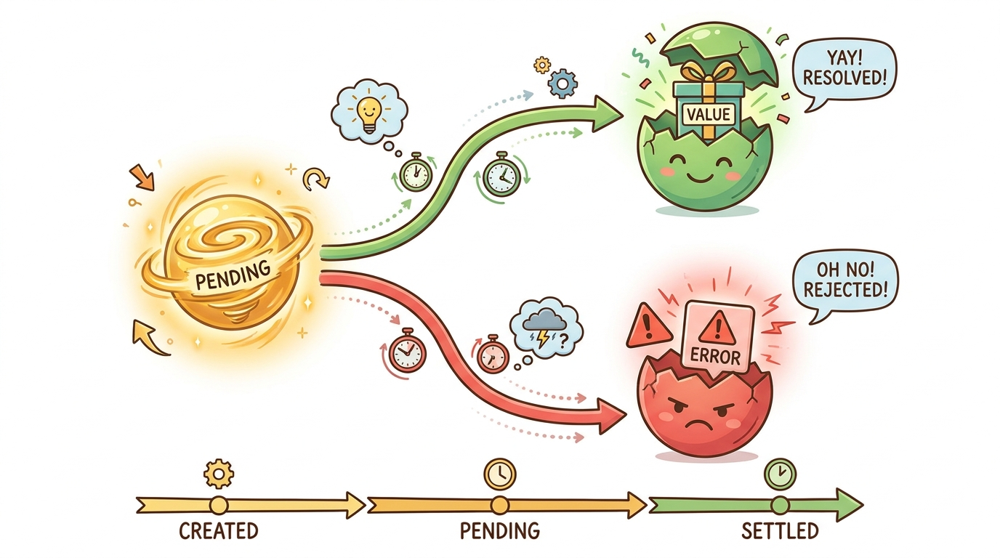

# Module 12: Async/Await and Promises

> 🏷️ When You're Ready

> 🎯 **Teach:** How Promises represent future values, how async/await makes asynchronous code read like synchronous code, and how Promise combinators let you run operations in parallel or race them against timeouts. **See:** Creating typed Promises, chaining with .then, rewriting chains as async/await, and building real async patterns like retry, batch processing, and async generators. **Feel:** Comfort reading and writing asynchronous TypeScript, knowing that the type system tracks Promise types through every await and combinator.

> 🔄 **Where this fits:** You have the full type system and module organization. Now you need to handle the reality that most real-world operations — network requests, file I/O, database queries — are asynchronous. This module teaches you how TypeScript types all of that.

## Promise Fundamentals

> 🎯 **Teach:** How to create typed Promises with resolve/reject, and the two ways to consume them — chaining with .then/.catch versus the cleaner async/await with try/catch. **See:** A typed delay function, a fetchUserById that resolves or rejects, .then chains versus equivalent async/await code, and sequential operations with timing. **Feel:** Comfort with the Promise lifecycle (pending, resolved, rejected) and a clear preference for async/await in most situations.

### Creating Typed Promises

> 🎙️ A Promise represents a value that will be available in the future. You create one by passing a function to the Promise constructor. That function receives two callbacks: resolve, which you call with the successful value, and reject, which you call with an error. TypeScript lets you type the Promise with a generic parameter so you know exactly what type the resolved value will be. The simplest async pattern is a delay function that returns a Promise of void — it resolves after a timeout with no value.

```typescript
// Create a typed promise
function delay(ms: number): Promise<void> {
    return new Promise(resolve => setTimeout(resolve, ms));
}

// Promise that resolves with a value
function fetchUserById(id: number): Promise<{ id: number; name: string }> {
    return new Promise((resolve, reject) => {
        setTimeout(() => {
            const users: Record<number, string> = { 1: "Alice", 2: "Bob", 3: "Carol" };
            const name = users[id];
            if (name) {
                resolve({ id, name });
            } else {
                reject(new Error(`User ${id} not found`));
            }
        }, 100);
    });
}
```


*Promise lifecycle — pending, then either resolved with a value or rejected with an error*

### Chaining with .then vs async/await

> 🎙️ There are two ways to consume Promises. The original way is chaining with dot-then: you call dot-then on the Promise and pass a callback that receives the resolved value. Each dot-then returns a new Promise, so you can chain them. The modern way is async/await: you mark a function as async, then use the await keyword to pause execution until the Promise resolves. The result is the same, but async/await reads like synchronous code, which makes it much easier to follow. Both approaches handle errors — dot-then uses dot-catch, while async/await uses try/catch.

```typescript
async function main() {
    // Chaining promises with .then
    console.log("=== Promise Chaining ===");
    await fetchUserById(1)
        .then(user => {
            console.log(`Found: ${user.name}`);
            return user.name.length;
        })
        .then(length => console.log(`Name length: ${length}`))
        .catch(err => console.error(`Error: ${err.message}`));

    // async/await version
    console.log("\n=== async/await ===");
    try {
        const user = await fetchUserById(2);
        console.log(`Found: ${user.name}`);
    } catch (err) {
        console.error(`Error: ${(err as Error).message}`);
    }

    // Handling rejection
    console.log("\n=== Handling Rejection ===");
    try {
        const user = await fetchUserById(999);
        console.log(user); // Never reached
    } catch (err) {
        console.error(`Expected error: ${(err as Error).message}`);
    }

    // Sequential async operations
    console.log("\n=== Sequential Operations ===");
    const start = Date.now();
    await delay(100);
    console.log(`Step 1 done at ${Date.now() - start}ms`);
    await delay(100);
    console.log(`Step 2 done at ${Date.now() - start}ms`);
    await delay(100);
    console.log(`Step 3 done at ${Date.now() - start}ms`);
}

main();
```

---

## Promise Combinators

> 🎯 **Teach:** How Promise.all runs operations in parallel (fail-fast), Promise.allSettled collects all outcomes even when some fail, and Promise.race returns whichever settles first — enabling timeout patterns. **See:** Parallel fetching of user/orders/preferences with Promise.all, partial-success handling with Promise.allSettled, a fetchWithTimeout using Promise.race, and batch fetching with mapped arrays. **Feel:** Power — you can orchestrate multiple async operations exactly the way your application needs.

### Promise.all — Parallel Execution

> 🎙️ When you have multiple async operations that do not depend on each other, you should run them in parallel rather than one after another. Promise.all takes an array of Promises and returns a single Promise that resolves with an array of all the results — but only if every Promise succeeds. If any one fails, the entire Promise.all rejects. TypeScript preserves the tuple types, so if you pass three different Promise types, you get a tuple of three different result types back.

```typescript
// Simulated async data sources
function fetchUser(id: number): Promise<{ id: number; name: string }> {
    return new Promise(resolve =>
        setTimeout(() => resolve({ id, name: `User_${id}` }), Math.random() * 200 + 50)
    );
}

function fetchOrders(userId: number): Promise<{ orderId: string; total: number }[]> {
    return new Promise(resolve =>
        setTimeout(() => resolve([
            { orderId: `ORD-${userId}-001`, total: 29.99 },
            { orderId: `ORD-${userId}-002`, total: 59.99 },
        ]), Math.random() * 200 + 50)
    );
}

function fetchPreferences(userId: number): Promise<{ theme: string; lang: string }> {
    return new Promise(resolve =>
        setTimeout(() => resolve({ theme: "dark", lang: "en" }), Math.random() * 200 + 50)
    );
}
```

```typescript
async function main() {
    // Promise.all — parallel execution, all must succeed
    console.log("=== Promise.all ===");
    const start1 = Date.now();
    const [user, orders, prefs] = await Promise.all([
        fetchUser(1),
        fetchOrders(1),
        fetchPreferences(1),
    ]);
    console.log(`Fetched in ${Date.now() - start1}ms (parallel)`);
    console.log(`  User: ${user.name}`);
    console.log(`  Orders: ${orders.length}`);
    console.log(`  Theme: ${prefs.theme}`);

    // Compare with sequential
    console.log("\n=== Sequential (slower) ===");
    const start2 = Date.now();
    const user2 = await fetchUser(2);
    const orders2 = await fetchOrders(2);
    const prefs2 = await fetchPreferences(2);
    console.log(`Fetched in ${Date.now() - start2}ms (sequential)`);
    console.log(`  User: ${user2.name}`);
```

### Promise.allSettled — Get Results Even If Some Fail

> 🎙️ Promise.all fails fast — if any one Promise rejects, you lose everything. Sometimes you want to fire off multiple requests and get back whatever succeeded along with information about what failed. That is what Promise.allSettled does. It waits for every Promise to settle, whether it resolved or rejected, and returns an array of result objects. Each result has a status of either fulfilled with a value or rejected with a reason. This is essential for batch operations where partial success is acceptable.

```typescript
    // Fails sometimes
    function unreliableFetch(label: string): Promise<string> {
        return new Promise((resolve, reject) =>
            setTimeout(() => {
                if (Math.random() > 0.5) resolve(`${label}: success`);
                else reject(new Error(`${label}: failed`));
            }, 100)
        );
    }

    // Promise.allSettled — get results even if some fail
    console.log("\n=== Promise.allSettled ===");
    const results = await Promise.allSettled([
        unreliableFetch("API-A"),
        unreliableFetch("API-B"),
        unreliableFetch("API-C"),
    ]);

    for (const result of results) {
        if (result.status === "fulfilled") {
            console.log(`  OK: ${result.value}`);
        } else {
            console.log(`  FAIL: ${result.reason.message}`);
        }
    }
```

### Promise.race — First to Settle Wins

> 🎙️ Promise.race returns the result of whichever Promise settles first. The classic use case is a timeout: you race your real request against a timer that rejects after a deadline. If the request finishes first, you get the data. If the timer fires first, you get a timeout error. This pattern is essential for any code that talks to external services where you cannot afford to wait forever.

```typescript
    // Promise.race — first to settle wins
    console.log("\n=== Promise.race ===");
    function fetchWithTimeout<T>(promise: Promise<T>, ms: number): Promise<T> {
        const timeout = new Promise<never>((_, reject) =>
            setTimeout(() => reject(new Error("Timeout")), ms)
        );
        return Promise.race([promise, timeout]);
    }

    try {
        const fast = await fetchWithTimeout(fetchUser(3), 500);
        console.log(`  Got user before timeout: ${fast.name}`);
    } catch (err) {
        console.log(`  Timed out: ${(err as Error).message}`);
    }

    // Promise.all with mapped array
    console.log("\n=== Batch Fetch ===");
    const userIds = [1, 2, 3, 4, 5];
    const allUsers = await Promise.all(userIds.map(id => fetchUser(id)));
    console.log(`  Fetched ${allUsers.length} users: ${allUsers.map(u => u.name).join(", ")}`);
}

main();
```

---

## Typed Async Patterns

> 🎯 **Teach:** How TypeScript generics combine with async/await to build reusable patterns — typed API wrappers, retry with backoff, batch processing with concurrency control, and async generators for streaming data. **See:** A generic apiGet function with typed responses, a withRetry function that preserves return types, a batchProcess function with configurable chunk sizes, an async generator with for-await-of, and try/catch/finally for resource cleanup. **Feel:** Readiness to build production-quality async utilities that are both generic and fully type-safe.

### Generic Async Functions

> 🎙️ TypeScript's generics combine powerfully with async/await. You can write a generic apiGet function that takes a type parameter and returns a Promise of a typed response wrapper. The caller specifies the type, and TypeScript ensures the resolved value matches. This is how real API client libraries work — they give you typed responses without sacrificing flexibility.

```typescript
// Typed async function signatures
type ApiResponse<T> = {
    data: T;
    status: number;
    timestamp: Date;
};

type User = { id: number; name: string; email: string };
type Post = { id: number; title: string; body: string; authorId: number };

// Simulate typed API calls
async function apiGet<T>(endpoint: string, mockData: T, delayMs: number = 50): Promise<ApiResponse<T>> {
    await new Promise(resolve => setTimeout(resolve, delayMs));
    return { data: mockData, status: 200, timestamp: new Date() };
}
```

```typescript
async function main() {
    // Typed API calls
    console.log("=== Typed API Calls ===");
    const userResponse = await apiGet<User>("/users/1", { id: 1, name: "Alice", email: "alice@example.com" });
    console.log(`User: ${userResponse.data.name} (status: ${userResponse.status})`);

    const postsResponse = await apiGet<Post[]>("/posts", [
        { id: 1, title: "First Post", body: "Hello world", authorId: 1 },
        { id: 2, title: "Second Post", body: "More content", authorId: 1 },
    ]);
    console.log(`Posts: ${postsResponse.data.map(p => p.title).join(", ")}`);
```

### Retry Pattern with Generics

> 🎙️ A retry function is a common async pattern. You pass it a function that returns a Promise, and it calls that function up to a maximum number of times, backing off between attempts. If any attempt succeeds, it returns the result immediately. If all attempts fail, it throws the last error. With TypeScript generics, the retry function preserves the return type of whatever function you pass in — the caller gets back the same typed result they would get from a single call.

```typescript
    // Retry pattern with generics
    async function withRetry<T>(fn: () => Promise<T>, maxRetries: number = 3): Promise<T> {
        let lastError: Error | undefined;
        for (let attempt = 1; attempt <= maxRetries; attempt++) {
            try {
                return await fn();
            } catch (err) {
                lastError = err as Error;
                console.log(`  Attempt ${attempt} failed: ${lastError.message}`);
                if (attempt < maxRetries) {
                    await new Promise(resolve => setTimeout(resolve, 50 * attempt));
                }
            }
        }
        throw lastError;
    }

    // Retry pattern
    console.log("\n=== Retry Pattern ===");
    let callCount = 0;
    try {
        const result = await withRetry(async () => {
            callCount++;
            if (callCount < 3) throw new Error("Not ready yet");
            return "Success on attempt 3";
        });
        console.log(`  Result: ${result}`);
    } catch (err) {
        console.log(`  Failed after retries: ${(err as Error).message}`);
    }
```

### Batch Processing

> 🎙️ When you have many items to process asynchronously, you often cannot fire them all at once — you might overwhelm an API or run out of memory. The batch processing pattern divides items into chunks and processes each chunk in parallel with Promise.all before moving on to the next. TypeScript generics make this pattern reusable: you parameterize the input type, the output type, and the processor function, and the batch function handles the rest.

```typescript
    // Throttle parallel requests
    async function batchProcess<T, R>(
        items: T[],
        processor: (item: T) => Promise<R>,
        batchSize: number = 2
    ): Promise<R[]> {
        const results: R[] = [];
        for (let i = 0; i < items.length; i += batchSize) {
            const batch = items.slice(i, i + batchSize);
            const batchResults = await Promise.all(batch.map(processor));
            results.push(...batchResults);
            console.log(`  Processed batch ${Math.floor(i / batchSize) + 1}`);
        }
        return results;
    }

    // Batch processing
    console.log("\n=== Batch Processing ===");
    const ids = [1, 2, 3, 4, 5, 6];
    const users = await batchProcess(ids, async (id) => {
        return apiGet<User>(`/users/${id}`, { id, name: `User_${id}`, email: `user${id}@example.com` });
    }, 2);
    console.log(`  Total fetched: ${users.length}`);
```

### Async Generators

> 🎙️ An async generator is a function that can yield values over time, pausing between each one. You declare it with async function star and use yield to emit values. The consumer uses a for-await-of loop to receive values as they become available. This is useful for streaming data, paginated API results, or any scenario where you produce values asynchronously one at a time rather than all at once.

```typescript
    // Async generator (async iteration)
    async function* generateIds(count: number): AsyncGenerator<number> {
        for (let i = 1; i <= count; i++) {
            await new Promise(resolve => setTimeout(resolve, 30));
            yield i;
        }
    }

    // Async iteration
    console.log("\n=== Async Generator ===");
    for await (const id of generateIds(5)) {
        console.log(`  Generated ID: ${id}`);
    }
```

### try/catch/finally in Async Code

```typescript
    // finally block in async
    console.log("\n=== try/catch/finally ===");
    async function connectToDatabase(): Promise<string> {
        console.log("  Opening connection...");
        try {
            await new Promise(resolve => setTimeout(resolve, 50));
            console.log("  Query executed");
            return "query result";
        } catch (err) {
            console.log(`  Query failed: ${(err as Error).message}`);
            throw err;
        } finally {
            console.log("  Closing connection (always runs)");
        }
    }

    const dbResult = await connectToDatabase();
    console.log(`  Result: ${dbResult}`);
}

main();
```

---

## Sharpen Your Pencil

> 🎯 **Teach:** How to apply Promise fundamentals, combinators, and typed async patterns in your own code through focused practice. **See:** Five exercises covering typed delay functions, parallel fetching with Promise.all, error separation with Promise.allSettled, timeout racing, and batch processing. **Feel:** Confidence that you can write and orchestrate async TypeScript code for any real-world scenario.

> ✏️ Sharpen Your Pencil

1. Write a function `fetchWithDelay<T>(data: T, ms: number): Promise<T>` that resolves with the given data after the specified delay. Call it with different types and verify TypeScript infers the return type correctly.
2. Use `Promise.all` to fetch three different types of data in parallel. Destructure the result into typed variables.
3. Use `Promise.allSettled` with an array of Promises where some fail. Write code to separate the successes from the failures with proper type narrowing on the `status` field.
4. Implement a `fetchWithTimeout` wrapper that races a real Promise against a timer. Test it with both a fast Promise (that wins) and a slow one (that loses to the timeout).
5. Write a `batchProcess` function that processes an array of URLs (strings) in batches of 3, simulating a fetch for each. Log which batch is being processed.

---

> 💡 **Remember this one thing:** async/await is syntactic sugar over Promises — same thing, cleaner syntax, better error handling with try/catch.

---

## Up Next

> 🎯 **Teach:** Where the learning journey goes from here. **See:** A preview of Module 13 covering custom error hierarchies, the Result type pattern, and async error handling. **Feel:** Momentum — you can write async code, and now you need to handle the errors that async operations inevitably produce.

In **Module 13: Error Handling**, you will learn how to build custom error hierarchies, use the Result type pattern as an alternative to try/catch, and handle errors gracefully in asynchronous code.
