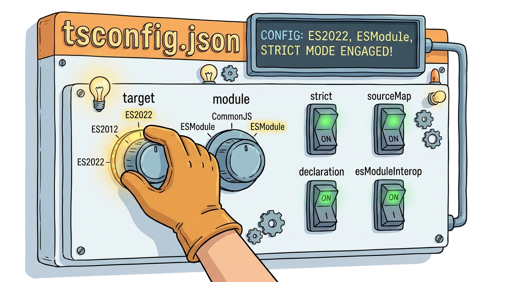

# Module 16: tsconfig and Build Configuration

> 🏷️ Advanced

> 🎯 **Teach:** How tsconfig.json controls TypeScript compilation -- target output, module system, strict checking, declaration files, and source maps. **See:** The same TypeScript code compiled to different targets, strict mode catching real bugs, and .d.ts declaration files generated automatically. **Feel:** Confident that you understand what every key compiler option does and why strict mode should always be enabled.

> 🔄 **Where this fits:** You have been using the TypeScript compiler without fully understanding its configuration. This module opens the hood on tsconfig.json, the file that controls everything about how your TypeScript becomes JavaScript. Understanding these options is essential for any project beyond simple scripts.

## What Is tsconfig.json?

> 🎯 **Teach:** What tsconfig.json is and the three things it controls -- errors caught, JavaScript produced, and module resolution. **See:** A minimal tsconfig.json with the most important compiler options and a reference table. **Feel:** Clear that this single file is the control panel for your entire TypeScript project.

### The Compiler's Configuration File

> 🎙️ tsconfig.json is the single file that controls how TypeScript compiles your code. Every option in this file affects one of three things: what errors are caught, what JavaScript is produced, and how modules are resolved. When you run tsc with no arguments, it looks for tsconfig.json in the current directory and follows its instructions exactly. Understanding these options is the difference between a project that catches bugs early and one that lets them slip through.

```json
{
  "compilerOptions": {
    "target": "ES2022",
    "module": "commonjs",
    "strict": true,
    "outDir": "./dist",
    "rootDir": "./src"
  },
  "include": ["src/**/*"],
  "exclude": ["node_modules", "dist"]
}
```

### Key Compiler Options at a Glance

| Option | Purpose |
|--------|---------|
| `target` | Which JS version to compile to (ES5, ES2015, ES2022, ESNext) |
| `module` | Module system (commonjs, ESNext, NodeNext) |
| `strict` | Enable all strict type-checking flags |
| `outDir` | Where compiled `.js` files go |
| `rootDir` | Where source `.ts` files live |
| `declaration` | Generate `.d.ts` type declaration files |
| `sourceMap` | Generate `.map` files for debugging |
| `esModuleInterop` | Better compatibility with CommonJS imports |


*tsconfig.json is your compiler's control panel*

---

## Creating a tsconfig from Scratch

> 🎯 **Teach:** How to generate a default tsconfig and then write a clean, production-ready one from scratch. **See:** `tsc --init` output compared to a hand-written config with only the options you need. **Feel:** Confident writing your own tsconfig.json for any new project without copying boilerplate you don't understand.

### Generating and Writing Your Own

> 🎙️ You can generate a default tsconfig.json with the tsc init command, which creates a heavily commented file showing every available option. But for real projects, it is better to write your own clean configuration from scratch, including only the options you need. This way you understand every line in the file. Here is a production-ready tsconfig that covers the most important options.

Set up a lab project:

```bash
mkdir ~/tsconfig-lab
cd ~/tsconfig-lab
npm init -y
npm install --save-dev typescript @types/node
```

Generate the default config to see all available options:

```bash
npx tsc --init
```

Open `tsconfig.json` -- notice it is heavily commented. Read through the comments for at least 10 options to understand what they do.

Now delete the generated file and write your own clean version:

```json
{
  "compilerOptions": {
    "target": "ES2022",
    "module": "commonjs",
    "lib": ["ES2022"],
    "outDir": "./dist",
    "rootDir": "./src",
    "strict": true,
    "esModuleInterop": true,
    "forceConsistentCasingInFileNames": true,
    "skipLibCheck": true,
    "declaration": true,
    "sourceMap": true,
    "resolveJsonModule": true
  },
  "include": ["src/**/*"],
  "exclude": ["node_modules", "dist"]
}
```

---

## Compiling with Different Targets

> 🎯 **Teach:** How the `target` option changes the JavaScript output, from modern pass-through to heavily transformed ES5. **See:** The same TypeScript file compiled to ES2022 and ES5 side by side, with arrow functions, async/await, and optional chaining transformed. **Feel:** A concrete understanding of why target matters and when to choose each setting.

### How Target Changes the Output

> 🎙️ The target option tells TypeScript which version of JavaScript to produce. When you target ES2022, modern syntax like arrow functions, optional chaining, and async/await passes through unchanged because modern runtimes support them natively. But when you target ES5, the compiler has to transform all of that modern syntax into older JavaScript that ancient browsers can understand. Arrow functions become function declarations. Async/await becomes a state machine. Template literals become string concatenation. Same TypeScript source, dramatically different JavaScript output.

Create `src/target_test.ts`:

```bash
mkdir src
```

```typescript
// src/target_test.ts

// ES2015+ features
const greet = (name: string): string => `Hello, ${name}!`;

// ES2017: async/await
async function fetchData(): Promise<string> {
    return "data loaded";
}

// ES2020: optional chaining and nullish coalescing
interface Config {
    database?: {
        host?: string;
        port?: number;
    };
}

const config: Config = {};
const host = config.database?.host ?? "localhost";
const port = config.database?.port ?? 5432;

// ES2021: String.replaceAll
const messy = "foo--bar--baz";
const clean = messy.replaceAll("--", " ");

// ES2022: Object.hasOwn
const obj = { name: "Alice", age: 25 };
const hasName = Object.hasOwn(obj, "name");

console.log(greet("TypeScript"));
console.log(`Host: ${host}:${port}`);
console.log(`Clean: ${clean}`);
console.log(`Has name: ${hasName}`);

fetchData().then(console.log);
```

### Comparing ES2022 vs ES5 Output

Compile with different targets and observe the results:

```bash
# Compile with ES2022 (default from your config)
npx tsc
cat dist/target_test.js
echo "---"

# Now change target to ES5 and recompile
# Edit tsconfig.json: "target": "ES5"
npx tsc
cat dist/target_test.js
```

Compare the two outputs. Notice how:
- Arrow functions become `function` declarations in ES5
- `async/await` becomes a state machine in ES5
- Template literals become string concatenation in ES5
- Optional chaining is desugared in ES5

Change the target back to `ES2022` before continuing.

---

## Strict Mode Flags

> 🎯 **Teach:** What the seven individual strict flags do and why `strict: true` should always be enabled. **See:** Code examples where strictNullChecks, noImplicitAny, and strictPropertyInitialization catch real bugs that permissive mode misses. **Feel:** Convinced that strict mode is a safety feature, not an obstacle.

### What Strict Mode Catches

> 🎙️ The strict flag in tsconfig.json is actually a shortcut that enables seven individual type-checking flags at once. Each one catches a different category of bug. strictNullChecks prevents you from using a value that might be null without checking first. noImplicitAny forces you to declare types instead of letting them default to the unsafe any type. strictPropertyInitialization ensures every class property is assigned in the constructor. When you enable strict mode, you are telling TypeScript to be as vigilant as possible. Every one of these checks catches real bugs that would otherwise slip into production.

Create `src/strict_demo.ts`:

```typescript
// src/strict_demo.ts
// Demonstrates what strict mode catches

// --- strictNullChecks ---
function getLength(str: string | null): number {
    // Without strictNullChecks, this compiles but crashes at runtime
    // With strictNullChecks, TypeScript forces you to handle null
    if (str === null) {
        return 0;
    }
    return str.length;
}

console.log(getLength("hello")); // 5
console.log(getLength(null));    // 0

// --- noImplicitAny ---
// Without noImplicitAny, parameters without types default to 'any'
// With it, you must explicitly type everything
function add(a: number, b: number): number {
    return a + b;
}

// --- strictFunctionTypes ---
type Animal = { name: string };
type Dog = { name: string; breed: string };

// With strictFunctionTypes, function parameter types are checked contravariantly
const dogHandler: (animal: Animal) => void = (a: Animal) => {
    console.log(a.name);
};

// --- strictPropertyInitialization ---
class User {
    name: string;
    email: string;

    constructor(name: string, email: string) {
        // Without strictPropertyInitialization, forgetting to assign
        // a property in the constructor is allowed
        this.name = name;
        this.email = email;
    }
}

const user = new User("Alice", "alice@example.com");
console.log(`${user.name} <${user.email}>`);

// --- noUnusedLocals and noUnusedParameters ---
// Uncomment these in tsconfig to catch unused variables
function process(input: string): string {
    // const unused = 42; // Would error with noUnusedLocals
    return input.toUpperCase();
}

console.log(process("hello"));

// Summary of strict flags
const strictFlags = [
    "strictNullChecks         — No implicit null/undefined",
    "noImplicitAny            — No implicit 'any' types",
    "strictFunctionTypes      — Stricter function type checking",
    "strictPropertyInitialization — Class properties must be initialized",
    "strictBindCallApply      — Check bind/call/apply arguments",
    "noImplicitThis           — No implicit 'this' type",
    "alwaysStrict             — Emit 'use strict' in JS output",
];

console.log("\nStrict Mode Flags (all enabled by \"strict\": true):");
strictFlags.forEach(flag => console.log(`  ${flag}`));
```

### Toggling Strict Mode

1. Compile with `"strict": true` -- everything should compile cleanly.
2. Temporarily change to `"strict": false` and add intentional errors:

```typescript
// These only error with strict: true
function broken(x) { return x.length; }  // implicit any
let data: string = null;                  // null assigned to string
```

Confirm the errors appear with `strict: true` and disappear with `strict: false`. Then restore `strict: true`.

---

## Declaration Files and Source Maps

> 🎯 **Teach:** What `.d.ts` declaration files and `.js.map` source maps are and why they are generated. **See:** A utility module compiled to produce all three output files -- .js, .d.ts, and .js.map -- with each one examined. **Feel:** Clear on why declaration files matter for library consumers and why source maps matter for debugging.

### What Gets Generated

> 🎙️ When you enable declaration and sourceMap in your tsconfig, the compiler produces two extra files alongside every JavaScript file. Declaration files, with the .d.ts extension, contain only the type signatures from your code -- no implementation. These are what other TypeScript projects use to understand your module's types without reading the actual source. Source maps are .js.map files that map lines in the compiled JavaScript back to lines in your original TypeScript, which is essential for debugging. When you set a breakpoint in your TypeScript, the debugger uses the source map to find the right place in the running JavaScript.

Create `src/math_utils.ts`:

```typescript
// src/math_utils.ts
// A utility module to demonstrate declaration file generation

export function add(a: number, b: number): number {
    return a + b;
}

export function multiply(a: number, b: number): number {
    return a * b;
}

export function clamp(value: number, min: number, max: number): number {
    return Math.min(Math.max(value, min), max);
}

export interface MathResult {
    operation: string;
    operands: number[];
    result: number;
}

export function calculate(
    op: "add" | "multiply",
    a: number,
    b: number
): MathResult {
    const result = op === "add" ? add(a, b) : multiply(a, b);
    return { operation: op, operands: [a, b], result };
}

// Use the functions
const results: MathResult[] = [
    calculate("add", 10, 20),
    calculate("multiply", 5, 6),
];

for (const r of results) {
    console.log(`${r.operation}(${r.operands.join(", ")}) = ${r.result}`);
}

console.log(`clamp(15, 0, 10) = ${clamp(15, 0, 10)}`);
console.log(`clamp(-5, 0, 10) = ${clamp(-5, 0, 10)}`);
```

### Examining the Output

Build and look at the generated files:

```bash
npx tsc
ls dist/
```

You should see three files for `math_utils`:
- `math_utils.js` -- the compiled JavaScript
- `math_utils.d.ts` -- type declarations (because `"declaration": true`)
- `math_utils.js.map` -- source map (because `"sourceMap": true`)

Examine each:

```bash
cat dist/math_utils.js      # Compiled JS — no types
cat dist/math_utils.d.ts    # Just the type signatures — used by other TS projects
cat dist/math_utils.js.map  # Maps JS lines back to TS lines for debugging
```

---

## Additional Configuration

> 🎯 **Teach:** How `resolveJsonModule` and other secondary options round out your tsconfig knowledge. **See:** Importing a JSON file directly into TypeScript with automatic type inference. **Feel:** Equipped with a complete mental model of tsconfig.json and ready to configure any project.

### resolveJsonModule and More

> 🎙️ The resolveJsonModule option lets you import JSON files directly in your TypeScript code, and TypeScript will infer the types from the JSON structure automatically. This is extremely useful for configuration files, data files, and any static data your application needs. Combined with the other options we have covered, you now have a complete picture of how tsconfig.json shapes your project.

Create `src/data.json`:

```json
{
  "appName": "TSConfig Lab",
  "version": "1.0.0",
  "features": ["strict mode", "source maps", "declarations", "JSON imports"]
}
```

Create `src/config_showcase.ts`:

```typescript
// src/config_showcase.ts
// Demonstrates resolveJsonModule and path-related options

// resolveJsonModule lets you import JSON files
import data from "./data.json";

console.log("Loaded JSON data:");
console.log(`  App: ${data.appName}`);
console.log(`  Version: ${data.version}`);
console.log(`  Features: ${data.features.join(", ")}`);

// Compiler options reference
const configOptions: Record<string, string> = {
    target: "JS version to emit (ES5, ES2015, ES2022, ESNext)",
    module: "Module system (commonjs, ESNext, NodeNext)",
    strict: "Enable all strict checks",
    outDir: "Output directory for compiled files",
    rootDir: "Root directory of source files",
    declaration: "Generate .d.ts files",
    sourceMap: "Generate .js.map files",
    esModuleInterop: "Better CommonJS/ES module compatibility",
    resolveJsonModule: "Allow importing .json files",
    skipLibCheck: "Skip type checking of .d.ts files",
    forceConsistentCasingInFileNames: "Enforce consistent file name casing",
};

console.log("\ntsconfig.json Compiler Options:");
for (const [option, description] of Object.entries(configOptions)) {
    console.log(`  ${option.padEnd(38)} — ${description}`);
}
```

Build and run:

```bash
npx tsc
node dist/config_showcase.js
```

---

## Sharpen Your Pencil

> ✏️ Sharpen Your Pencil

1. Generate a default `tsconfig.json` with `npx tsc --init` and read the comments for at least 10 options.
2. Delete it and write your own from scratch with `target`, `module`, `strict`, `outDir`, `rootDir`, `declaration`, and `sourceMap`.
3. Create `src/target_test.ts` using ES2015+ features. Compile with `ES2022` target, then change to `ES5` and recompile. Compare the JavaScript output side by side.
4. Create `src/strict_demo.ts` demonstrating `strictNullChecks`, `noImplicitAny`, `strictFunctionTypes`, and `strictPropertyInitialization`. Toggle strict mode off and see what slips through.
5. Create `src/math_utils.ts` and compile with `declaration: true` and `sourceMap: true`. Examine the generated `.d.ts` and `.js.map` files.
6. Create `src/data.json` and `src/config_showcase.ts` to test `resolveJsonModule`.

---

> 💡 **Remember this one thing:** Always enable strict mode -- it catches real bugs that permissive settings miss.

---

## Up Next

In **Module 17: Testing with Vitest**, you will learn how to write automated tests that verify your code works correctly, catch regressions, and serve as living documentation.
