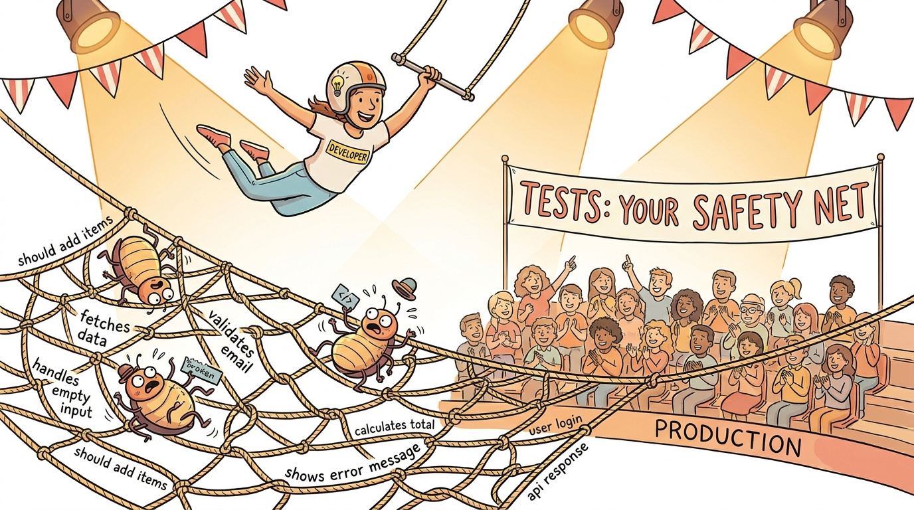

# Module 17: Testing with Vitest

> 🏷️ Advanced

> 🎯 **Teach:** How to write automated tests using Vitest -- from basic assertions to mocking and async patterns. **See:** A complete test suite covering string utilities, math functions, and async operations, with coverage reports showing exactly what is tested. **Feel:** Confident that tests are not overhead but a safety net and a form of documentation that makes refactoring fearless.

> 🔄 **Where this fits:** You can write TypeScript modules and compile them. Now you need to prove they work correctly. Testing is the professional practice that separates scripts from production code. Every pattern you have learned -- types, functions, classes, async/await, error handling -- gets exercised and verified here.

## Why Test?

> 🎯 **Teach:** Why automated tests exist -- as both documentation and safety nets against regressions. **See:** A simple describe/it/expect test and a table of common Vitest matchers. **Feel:** Motivated to write tests as a professional habit, not a chore.

### Tests as Documentation and Safety Nets

> 🎙️ Tests serve two purposes that are equally important. First, they are documentation: a well-written test suite describes exactly what your code is supposed to do, with concrete examples. Second, they are safety nets: when you change your code, tests tell you immediately if you broke something. Vitest is a fast, TypeScript-native test runner that uses the familiar describe, it, and expect syntax. It works with TypeScript out of the box, with no extra configuration, and it runs so fast that you can leave it in watch mode while you code.

```typescript
import { describe, it, expect } from "vitest";

describe("add", () => {
    it("adds two numbers", () => {
        expect(1 + 2).toBe(3);
    });

    it("handles negative numbers", () => {
        expect(-1 + -2).toBe(-3);
    });
});
```

### Common Matchers

```typescript
expect(value).toBe(exact);            // Strict equality (===)
expect(value).toEqual(deep);          // Deep equality for objects/arrays
expect(value).toBeTruthy();           // Truthy check
expect(value).toBeNull();             // Is null
expect(value).toContain(item);        // Array/string contains
expect(fn).toThrow();                 // Function throws
expect(value).toBeGreaterThan(n);     // Numeric comparison
```


*Tests catch bugs before they reach users*

---

## Project Setup

> 🎯 **Teach:** How to set up a Vitest project with TypeScript, test scripts, and a proper directory structure. **See:** `npm init`, dependency installation, tsconfig creation, and package.json scripts for test, watch, and coverage. **Feel:** Ready to set up a test-enabled project from scratch in under two minutes.

### Initializing a Vitest Project

> 🎙️ Setting up Vitest is straightforward. You install it as a dev dependency alongside TypeScript, add test scripts to your package.json, and create a directory structure that separates source code from test code. The convention is to put your source in src/ and your tests in tests/, with test files named to match the modules they test. Vitest finds and runs any file ending in .test.ts automatically.

```bash
mkdir ~/vitest-lab
cd ~/vitest-lab
npm init -y
npm install --save-dev typescript vitest @types/node
npx tsc --init --strict --outDir dist --rootDir src --esModuleInterop --module ESNext --moduleResolution bundler
```

Add the test scripts to `package.json`:

```json
{
  "type": "module",
  "scripts": {
    "test": "vitest run",
    "test:watch": "vitest",
    "test:coverage": "vitest run --coverage"
  }
}
```

Create the directory structure:

```bash
mkdir src tests
```

---

## Writing Testable Modules

> 🎯 **Teach:** How to write small, focused modules with pure functions that are easy to test. **See:** Three utility modules -- string, math, and async -- each exporting functions with clear inputs, outputs, and edge cases. **Feel:** Aware that testable code is well-designed code, and that writing tests starts with writing good modules.

### String Utilities

Create `src/string-utils.ts`:

```typescript
// src/string-utils.ts

export function capitalize(str: string): string {
    if (str.length === 0) return str;
    return str[0].toUpperCase() + str.slice(1).toLowerCase();
}

export function slugify(str: string): string {
    return str
        .toLowerCase()
        .trim()
        .replace(/[^a-z0-9\s-]/g, "")
        .replace(/\s+/g, "-")
        .replace(/-+/g, "-");
}

export function truncate(str: string, maxLength: number, suffix = "..."): string {
    if (str.length <= maxLength) return str;
    return str.slice(0, maxLength - suffix.length) + suffix;
}

export function countWords(str: string): number {
    const trimmed = str.trim();
    if (trimmed.length === 0) return 0;
    return trimmed.split(/\s+/).length;
}

export function isPalindrome(str: string): boolean {
    const cleaned = str.toLowerCase().replace(/[^a-z0-9]/g, "");
    return cleaned === cleaned.split("").reverse().join("");
}
```

### Math Utilities

Create `src/math-utils.ts`:

```typescript
// src/math-utils.ts

export function clamp(value: number, min: number, max: number): number {
    if (min > max) throw new Error("min must be less than or equal to max");
    return Math.min(Math.max(value, min), max);
}

export function average(numbers: number[]): number {
    if (numbers.length === 0) throw new Error("Cannot average empty array");
    return numbers.reduce((sum, n) => sum + n, 0) / numbers.length;
}

export function factorial(n: number): number {
    if (n < 0) throw new Error("Factorial not defined for negative numbers");
    if (!Number.isInteger(n)) throw new Error("Factorial requires an integer");
    if (n <= 1) return 1;
    return n * factorial(n - 1);
}

export function fibonacci(n: number): number[] {
    if (n <= 0) return [];
    if (n === 1) return [0];
    const seq = [0, 1];
    for (let i = 2; i < n; i++) {
        seq.push(seq[i - 1] + seq[i - 2]);
    }
    return seq;
}
```

### Async Utilities

Create `src/async-utils.ts`:

```typescript
// src/async-utils.ts

export async function delay(ms: number): Promise<void> {
    return new Promise(resolve => setTimeout(resolve, ms));
}

export async function fetchUser(id: number): Promise<{ id: number; name: string }> {
    if (id <= 0) throw new Error("Invalid user ID");
    // Simulate API call
    await delay(10);
    return { id, name: `User ${id}` };
}

export async function retryAsync<T>(
    fn: () => Promise<T>,
    maxRetries: number
): Promise<T> {
    let lastError: Error | undefined;
    for (let attempt = 0; attempt <= maxRetries; attempt++) {
        try {
            return await fn();
        } catch (err) {
            lastError = err as Error;
        }
    }
    throw lastError;
}
```

---

## Writing Tests

> 🎯 **Teach:** How to write comprehensive tests covering happy paths, edge cases, error conditions, and async/mock patterns. **See:** Full test files for string utilities, math utilities, and async code using `vi.fn()` mocks. **Feel:** Confident structuring describe/it blocks and choosing the right matcher for each assertion.

### Testing String Utilities

> 🎙️ Each test file follows the same pattern: import describe, it, and expect from Vitest, import the functions you want to test, and then write describe blocks that group related tests. Inside each describe block, individual it calls make specific assertions about behavior. Good tests cover the happy path, edge cases, and error conditions. Notice how readable these tests are -- they serve as documentation for exactly what each function is supposed to do.

Create `tests/string-utils.test.ts`:

```typescript
// tests/string-utils.test.ts
import { describe, it, expect } from "vitest";
import { capitalize, slugify, truncate, countWords, isPalindrome } from "../src/string-utils";

describe("capitalize", () => {
    it("capitalizes the first letter", () => {
        expect(capitalize("hello")).toBe("Hello");
    });

    it("lowercases the rest of the string", () => {
        expect(capitalize("hELLO")).toBe("Hello");
    });

    it("handles empty string", () => {
        expect(capitalize("")).toBe("");
    });

    it("handles single character", () => {
        expect(capitalize("a")).toBe("A");
    });
});

describe("slugify", () => {
    it("converts to lowercase with hyphens", () => {
        expect(slugify("Hello World")).toBe("hello-world");
    });

    it("removes special characters", () => {
        expect(slugify("Hello, World!")).toBe("hello-world");
    });

    it("collapses multiple spaces", () => {
        expect(slugify("too   many   spaces")).toBe("too-many-spaces");
    });

    it("trims whitespace", () => {
        expect(slugify("  padded  ")).toBe("padded");
    });
});

describe("truncate", () => {
    it("returns short strings unchanged", () => {
        expect(truncate("hi", 10)).toBe("hi");
    });

    it("truncates long strings with suffix", () => {
        expect(truncate("Hello, World!", 8)).toBe("Hello...");
    });

    it("uses custom suffix", () => {
        expect(truncate("Hello, World!", 9, "~")).toBe("Hello, W~");
    });
});

describe("countWords", () => {
    it("counts words in a sentence", () => {
        expect(countWords("hello world")).toBe(2);
    });

    it("handles multiple spaces", () => {
        expect(countWords("one  two   three")).toBe(3);
    });

    it("returns 0 for empty string", () => {
        expect(countWords("")).toBe(0);
    });

    it("returns 0 for whitespace only", () => {
        expect(countWords("   ")).toBe(0);
    });
});

describe("isPalindrome", () => {
    it("detects palindromes", () => {
        expect(isPalindrome("racecar")).toBe(true);
    });

    it("is case-insensitive", () => {
        expect(isPalindrome("RaceCar")).toBe(true);
    });

    it("ignores non-alphanumeric characters", () => {
        expect(isPalindrome("A man, a plan, a canal: Panama")).toBe(true);
    });

    it("rejects non-palindromes", () => {
        expect(isPalindrome("hello")).toBe(false);
    });
});
```

### Testing Math Utilities

> 🎙️ Math tests are a great example of testing edge cases and error conditions. It is not enough to test that factorial of 5 is 120. You also need to test factorial of 0, which should be 1. And you need to test that factorial of negative 1 throws an error, and that factorial of 2.5 throws a different error. Testing the error paths is just as important as testing the happy paths -- these are the cases that crash production applications when they are not handled.

Create `tests/math-utils.test.ts`:

```typescript
// tests/math-utils.test.ts
import { describe, it, expect } from "vitest";
import { clamp, average, factorial, fibonacci } from "../src/math-utils";

describe("clamp", () => {
    it("clamps value above max", () => {
        expect(clamp(15, 0, 10)).toBe(10);
    });

    it("clamps value below min", () => {
        expect(clamp(-5, 0, 10)).toBe(0);
    });

    it("returns value within range", () => {
        expect(clamp(5, 0, 10)).toBe(5);
    });

    it("throws when min > max", () => {
        expect(() => clamp(5, 10, 0)).toThrow("min must be less than or equal to max");
    });
});

describe("average", () => {
    it("averages an array of numbers", () => {
        expect(average([1, 2, 3, 4, 5])).toBe(3);
    });

    it("handles single element", () => {
        expect(average([42])).toBe(42);
    });

    it("throws for empty array", () => {
        expect(() => average([])).toThrow("Cannot average empty array");
    });
});

describe("factorial", () => {
    it("computes factorial of 0", () => {
        expect(factorial(0)).toBe(1);
    });

    it("computes factorial of 5", () => {
        expect(factorial(5)).toBe(120);
    });

    it("computes factorial of 10", () => {
        expect(factorial(10)).toBe(3628800);
    });

    it("throws for negative input", () => {
        expect(() => factorial(-1)).toThrow("negative");
    });

    it("throws for non-integer input", () => {
        expect(() => factorial(2.5)).toThrow("integer");
    });
});

describe("fibonacci", () => {
    it("returns empty array for n=0", () => {
        expect(fibonacci(0)).toEqual([]);
    });

    it("returns [0] for n=1", () => {
        expect(fibonacci(1)).toEqual([0]);
    });

    it("returns first 6 fibonacci numbers", () => {
        expect(fibonacci(6)).toEqual([0, 1, 1, 2, 3, 5]);
    });

    it("returns first 10 fibonacci numbers", () => {
        expect(fibonacci(10)).toEqual([0, 1, 1, 2, 3, 5, 8, 13, 21, 34]);
    });
});
```

### Testing Async Code with Mocks

> 🎙️ Testing asynchronous code requires two additional tools. First, you mark your test functions as async and use await with expect for promises. Second, you use Vitest's vi.fn to create mock functions -- fake functions whose behavior you control. Mocking lets you test retry logic without making real API calls, and it lets you verify that functions are called the right number of times. The retryAsync tests here demonstrate both: a mock that fails twice then succeeds, and a mock that always fails to verify the error path.

Create `tests/async-utils.test.ts`:

```typescript
// tests/async-utils.test.ts
import { describe, it, expect, vi } from "vitest";
import { delay, fetchUser, retryAsync } from "../src/async-utils";

describe("delay", () => {
    it("resolves after the specified time", async () => {
        const start = Date.now();
        await delay(50);
        const elapsed = Date.now() - start;
        expect(elapsed).toBeGreaterThanOrEqual(40);
    });
});

describe("fetchUser", () => {
    it("returns a user with the given id", async () => {
        const user = await fetchUser(1);
        expect(user).toEqual({ id: 1, name: "User 1" });
    });

    it("returns correct user for different ids", async () => {
        const user = await fetchUser(42);
        expect(user.id).toBe(42);
        expect(user.name).toBe("User 42");
    });

    it("throws for invalid id", async () => {
        await expect(fetchUser(0)).rejects.toThrow("Invalid user ID");
        await expect(fetchUser(-1)).rejects.toThrow("Invalid user ID");
    });
});

describe("retryAsync", () => {
    it("returns result on first success", async () => {
        const fn = vi.fn().mockResolvedValue("success");
        const result = await retryAsync(fn, 3);
        expect(result).toBe("success");
        expect(fn).toHaveBeenCalledTimes(1);
    });

    it("retries on failure then succeeds", async () => {
        const fn = vi.fn()
            .mockRejectedValueOnce(new Error("fail 1"))
            .mockRejectedValueOnce(new Error("fail 2"))
            .mockResolvedValue("success");

        const result = await retryAsync(fn, 3);
        expect(result).toBe("success");
        expect(fn).toHaveBeenCalledTimes(3);
    });

    it("throws after exhausting retries", async () => {
        const fn = vi.fn().mockRejectedValue(new Error("always fails"));

        await expect(retryAsync(fn, 2)).rejects.toThrow("always fails");
        expect(fn).toHaveBeenCalledTimes(3); // initial + 2 retries
    });
});
```

---

## Running Tests and Coverage

> 🎯 **Teach:** How to run tests, use watch mode for rapid feedback, and generate coverage reports. **See:** `npm test` output with pass/fail indicators, watch mode re-running on save, and a coverage report showing statements, branches, functions, and lines. **Feel:** Excited by how fast the feedback loop is and motivated to keep coverage high.

### Running the Test Suite

> 🎙️ Running your tests is as simple as npm test. Vitest shows you which describe blocks and test cases passed, with green checkmarks for successes and red crosses for failures. Watch mode is even better for development: it re-runs tests automatically every time you save a file. Change a test to make it fail, fix it, and watch mode picks it up instantly. Code coverage reports tell you exactly which lines, branches, and functions your tests exercise, so you know where the gaps are.

Run all tests:

```bash
npm test
```

All tests should pass. Read the output -- Vitest shows which describe blocks and test cases passed.

### Watch Mode

```bash
npm run test:watch
```

Change a test to make it fail, then fix it. Watch mode re-runs automatically. Press `q` to quit.

### Code Coverage Reports

Install the coverage provider:

```bash
npm install --save-dev @vitest/coverage-v8
```

Run coverage:

```bash
npm run test:coverage
```

The coverage report shows:
- **Statements** -- percentage of code statements executed
- **Branches** -- percentage of if/else branches taken
- **Functions** -- percentage of functions called
- **Lines** -- percentage of lines executed

---

## Sharpen Your Pencil

> ✏️ Sharpen Your Pencil

1. Set up a Vitest project from scratch with `npm init`, TypeScript, and test scripts.
2. Create `src/string-utils.ts` with `capitalize`, `slugify`, `truncate`, `countWords`, and `isPalindrome`.
3. Create `src/math-utils.ts` with `clamp`, `average`, `factorial`, and `fibonacci`.
4. Create `src/async-utils.ts` with `delay`, `fetchUser`, and `retryAsync`.
5. Write comprehensive tests for all three modules, including edge cases and error conditions.
6. Use `vi.fn()` to create mock functions for testing `retryAsync`.
7. Run `npm test` and verify all tests pass. Run `npm run test:coverage` and examine the report.
8. Try watch mode: change a function to introduce a bug and watch the test fail, then fix it.

---

> 💡 **Remember this one thing:** Write tests that describe behavior, not implementation -- test what your code does, not how it does it.

---

## Up Next

In **Module 18: Advanced Patterns**, you will explore decorators, design patterns, mapped types, conditional types, and template literal types -- the tools that let TypeScript model complex real-world architecture.
